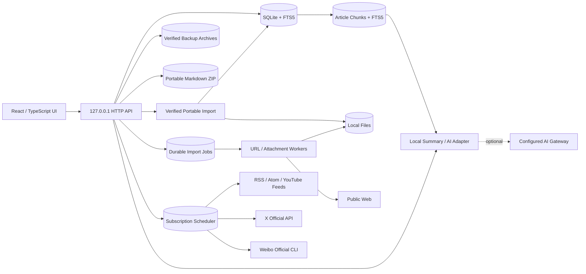

# Reader 架构说明

## 设计目标

Reader 把“本地数据是事实来源”作为首要约束。任何收藏、编辑、标签和阅读进度都应先成功写入 SQLite，再让界面呈现成功状态。网络导入和 AI 是可替换的增强能力，不应阻塞离线阅读。

## 运行结构

生产构建由 Electron 主进程启动随机回环端口的本地服务，再由沙箱化渲染进程加载静态界面和 `/api`。应用包中的 `dist` 只读，SQLite、附件与备份写入 `Application Support/Reader/ReaderData`，升级应用不会覆盖资料。数据模型和 API 仍保持独立边界，便于未来用 SwiftUI/WKWebView 逐模块替换。

## 数据模型

- `articles`：统一承载网页、Markdown、RSS、PDF 元数据和未来附件记录。
- `collections`：使用 `parent_id` 形成树形目录。
- `smart_collections`：保存可验证的规则 JSON 与用户排序；文章仍只存在于原资料夹。
- `tags` / `article_tags`：多对多标签。
- `sources`：订阅配置与运行状态；包括固定同步频率、下次运行、ETag/Last-Modified、平台用户 ID、增量游标、限流状态、连续失败、HTTP 状态和最近导入数。
- `highlights`：正文选区原文、渲染文本偏移、颜色和批注；随文章级联删除并进入数据库完整备份。
- `notes`：为后续独立卡片式笔记预留。
- `attachments`：文件名、MIME、大小、SHA-256 和安全存储名；文章与文件一对多。
- `import_jobs`：任务载荷、状态、尝试次数、错误和结果文章；运行中断后回到等待状态。
- `article_revisions`：文章内容字段的不可变快照；恢复旧版本时追加新快照而不改写历史。
- `article_search` / `article_search_trigram`：分别承载拉丁文字词法检索与三个及以上字符的中文子串检索，由独立触发器与文章表保持一致。
- `article_chunks` / `chunk_search`：按 Markdown 标题和段落生成的本地检索片段，以及由触发器维护的 FTS5 索引；记录原文偏移、内容哈希和稳定引用 ID。
- `schema_migrations`：记录已经提交的 schema 版本。
- `schema_migration_audit`：从 schema v9 起保存迁移的固定名称、SHA-256 校验值和应用时间；启动时与代码中的注册表逐项核对。

所有布尔值在 SQLite 中使用 0/1。API 对外转换为 JSON 布尔值，避免前端依赖数据库表示。

## 本地分块检索与引用

文章按 Markdown 标题、自然段和约 900 字符目标长度切分，单片段不超过 1,400 字符。片段保留标题、原文起止偏移和 SHA-256；文章创建、正文编辑、导入最终化和历史版本恢复都在同一 SQLite 事务中替换对应索引。Schema v5 升级时只回填尚未建立片段的文章。

问答先在本机执行候选检索：拉丁文字使用 FTS5，中文使用受限词组匹配，再按标题、摘要、段落标题、正文覆盖率和位置排序。候选必须达到相对分数与词组覆盖阈值；没有足够证据时返回“证据不足”，不会用文章开头或弱相关片段冒充引用。

本地模式使用提取式回答并标注 `[1]` 等引用。远程模式也先完成同一套本地检索，只把最多 8 个、每个最多 2,000 字符的命中片段发给网关，不发送整篇文章或整个资料库。界面显示检索范围、索引片段数、实际引用数，并可从引用卡片回到来源文章的定位片段。

资料夹读取使用递归 CTE 计算子树内容数，选择父资料夹时也会包含所有后代内容。移动资料夹会先拒绝自引用与环；删除非系统资料夹时，整棵子树的文章在同一事务中移入目标资料夹，再由外键级联移除目录节点。批量移动、标签、收藏、已读和归档同样在单一事务中提交，避免只更新一部分内容。

0.22.0 的资料列表按 `(created_at, id)` 倒序使用不透明游标分页，时间相同的记录仍有确定顺序；API 同时返回筛选后的准确总数和下一页状态。schema v10 为归档、未读、收藏、类型与资料夹视图增加匹配排序的复合索引，并用 FTS5 trigram 替换三个及以上字符中文查询的全表 `LIKE` 扫描。界面每页加载 100 条，快速切换查询时以请求代次丢弃过期响应，追加页面按文章 ID 去重；后台状态刷新不再重置用户已经加载的页面。

0.23.0 把列表和详情拆成明确的传输契约。`listArticlePage({ includeContent: false })` 使用显式列投影返回除 `content` 外的文章摘要；既有数据库数组调用默认仍返回全文，HTTP 列表端点则始终选择摘要模式。前端列表只保存 `ArticleSummary`，选中 ID 后单独调用详情端点，并用请求代次丢弃快速切换产生的过期正文；编辑、标记已读和新建内容会同时更新摘要与当前详情。文章卡片的视觉容器不再承担按钮角色，打开与选择是同级原生按钮；进入批量模式后移除整卡打开按钮，只保留单一选择语义。

0.24.0 在应用根部挂载单一 `DialogAccessibilityManager`，统一管理所有 `[role="dialog"][aria-modal="true"]`。管理器持续记录最近一次位于模态框外的焦点；窗口出现后保留组件自身的 `autoFocus`，否则聚焦第一个可用控件或对话框本身。捕获阶段的键盘处理把 Tab/Shift+Tab 约束在最上层窗口内，Esc 只点击当前窗口中未禁用的既有关闭按钮，因此继续复用编辑器未保存确认和忙碌态禁用等业务边界。窗口替换时保留最初触发器，全部关闭后再恢复焦点；嵌套的非模态高亮浮层不参与这套管理。

0.25.0 把侧栏的扁平缩进资料夹列表升级为单一焦点的 ARIA tree。服务端资料夹结构和 `flattenedCollections` 顺序不变；界面按本地折叠集合派生可见行，并为每行提供 `aria-level`、`aria-posinset`、`aria-setsize`、`aria-expanded` 和 `aria-selected`。上/下、Home/End 在可见行间移动焦点；右键展开或进入第一个子节点，左键折叠或返回父节点，Enter/Space 复用既有资料夹选择路径。树仍使用原生按钮作为 treeitem，文章拖放目标和点击筛选回调保持原位，折叠状态只属于当前界面会话，不写入用户数据库。

0.26.0 为编辑器和批注现有路径增加可访问状态层，不改变保存协议。编辑器以标题作为初始焦点，捕获 ⌘/Ctrl+S 后调用既有 `persist`，保存状态通过 `role=status` 播报；Markdown 与预览是具名 region，透明文件输入覆盖可见上传标签并用 `:focus-within` 显示焦点。阅读器正文和批注区可获得程序化焦点；高亮入口把焦点移到批注 region，颜色按钮公开 pressed 状态，定位、颜色与批注写回通过隐藏 live region 播报。选区浮层是具名的非模态 dialog，文档级 Escape 关闭后把焦点还给选区发起处；所有高亮 CRUD 仍使用既有本地 API。

0.29.0 为静态正文增加显式的纯键盘选取模式，不把文章变成可编辑控件。开启后正文保持只读 `document`，Reader 用当前 Electron Chromium 的原生 `Selection.modify` 推进 DOM Range：左右方向键按字符、上下方向键按视觉行、Option+方向键按词移动，Shift 把移动扩展为选区；Control+Option 组合不拦截，以保留 VoiceOver 导航。折叠光标和已选原文通过 live status 播报，在支持 CSS Custom Highlight 的运行时额外显示单字符光标标记。Enter 复用既有保存浮层，Escape、保存或取消都会清除 Range 并把焦点还给“键盘选取”按钮。正文从未设置 `contenteditable`，字符输入、删除、粘贴或输入法不会获得修改 DOM 的编辑面；高亮仍只在用户确认后通过既有 API 写入 SQLite。

0.30.0 用共享的 `FilePickerButton` 替换编辑器图片、附件、Reader ZIP、OPML 与备份恢复路径中依赖透明覆盖或微小输入框的文件入口。每个入口以原生可见按钮作为唯一交互面，受信任的点击触发同组件内隐藏的标准 `input[type=file]`，选择完成后只把浏览器提供的 `File` 对象交给既有同源流式上传；Electron preload 不新增路径、文件读取或任意 IPC。处理函数在清空 input 之前建立请求体，使立即上传不依赖选择器继续保留文件句柄，同时仍允许再次选择同一个文件。

0.31.0 把仅由 `active` class 表达的状态同步到辅助技术：资料库、智能资料夹与标签导航使用 `aria-current`；内容筛选、文章助手功能、检索范围、添加类型、智能规则匹配、重复组和文章批量选择使用 `aria-pressed`；版本预览公开当前项。文章打开与选择按钮通过同一隐藏描述关联已经加载的摘要字段，包含已读/收藏、来源、日期、类型、资料夹、最多三个标签和最多 180 字摘要，不读取完整正文；描述节点不会成为额外的浏览文本。视觉结构、按钮行为和 API 均不改变。

0.32.0 把生产路径中的网页 DOM/Readability/Turndown、PDF.js 文本抽取以及图片/PDF 缩略图解码移到一次性解析子进程。父进程只负责经过既有 SSRF/体积/暂存路径校验的输入、数据库事务与最终文件落盘；解析器以当前 Node 或打包 Electron 可执行文件的 Node 模式启动，V8 heap 上限为 256 MB，网页任务 15 秒、文件任务 30 秒，输入输出均有 12 MB IPC 上限，缩略图解码结果另限 2 MB。全局最多同时运行两个解析器、排队 32 个任务，超限直接返回可重试的繁忙错误。

解析子进程只继承语言、时区和临时目录等最小环境，不继承 Reader 或第三方密钥环境变量。目标 Node/Electron 运行时启用 Node permission model：只读应用代码与当前明确的源文件，拒绝文件写入、任意系统文件读取和再次创建子进程。每次 IPC 响应使用随机 nonce 边界，依赖库写入 stdout 的提示不能伪造结果。异常退出、超时、超限或无效响应只使当前导入/缩略图任务失败，父服务与后续解析任务继续运行。图片缩略图需要加载项目自带的原生 Canvas addon，因此该任务额外允许受信任 addon；这不是完整 OS 沙箱，安全收益主要是最小 Node 权限、资源上限和崩溃隔离。

0.33.0 在既有串行后台策略中加入持久化的用户导入暂停原因。队列窗口通过 `PUT /api/import-jobs/state` 只接受布尔值；状态先原子写入权限为 `0600` 的 `data/settings.json`，再暂停 worker，并在运行时切换失败时恢复原偏好。暂停会等待当前已领取任务完成，但不再领取下一项；待处理任务、尝试次数和暂存附件继续留在既有 SQLite/文件队列中。启动时先读取偏好，以暂停态创建 worker，再开放本地服务，因此重启不会短暂领取任务。

用户暂停只作用于导入 worker，不影响来源调度。服务端把它与资料恢复锁、睡眠和系统资源限制按原因集合合并；“继续队列”只移除用户原因，其他原因仍存在时 worker 保持暂停。`/api/health` 同时公开 `importUserPaused`、实际 `importsPaused` 和脱敏原因列表，标题栏与队列窗口据此区分“手动暂停”和系统限制；按钮使用原生 `aria-pressed`，状态变化由 polite live region 播报。

0.34.0 把三栏桌面的视觉 pane 名称映射为浏览器和 macOS AX 可识别的 landmarks：侧栏与文章助手分别是有名称的 complementary，内容区由当前一级标题命名为 region，阅读器 main 的名称随已完成加载的文章标题更新。App 根部保留单一 polite live status，在文章 ID 改变时先播报加载中，详情请求完成后再播报实际标题；传给阅读器和文章助手的详情必须与当前 ID 一致，避免快速切换时短暂暴露上一文章。内容区和阅读器以 `aria-busy` 区分本地读取状态，不改变请求、缓存或焦点路径。

界面通过 `prefers-reduced-motion: reduce` 继承 macOS“减少动态效果”：CSS 动画与过渡缩短为单次近零时长，JS 的高亮/批注定位从平滑滚动切换为即时滚动。运行任务仍由文字状态表达，不依赖旋转动画传递含义；默认视觉和数据行为保持不变。

同版本的十万篇门禁暴露出资料库总览统计会重复扫描文章表。`stats()` 保持原响应字段，但把总数、未读、收藏、笔记和归档改为五个独立标量计数，使 SQLite 分别使用现有 `archived`、`is_read`、`is_favorite` 与 `type` 覆盖索引；不增加 schema 或缓存，也不引入计数失效风险。

Schema v8 的智能资料夹只保存经过规范化的规则，不复制文章或引入第二套归属关系。规则允许组合正文关键词、受限内容类型、标签、来源、原资料夹、阅读/收藏状态、高亮、附件和最多 3,650 天的时间窗口。服务端把每条规则编译为参数化 SQLite 条件，基础条件始终排除归档内容；“任一满足”和“全部满足”只作用于用户规则，不得绕过基础边界。普通资料夹与智能资料夹排序都要求客户端提交完整同级 ID 集合，并在单一事务中重写连续位置，避免碰撞或部分排序。

## 可迁移导入导出与重复治理

选择性导出不复制数据库私有结构。服务端按用户指定顺序读取内容和附件，在内存中生成标准 Markdown frontmatter，把同源附件 URL 改写为相对路径，并流式输出 ZIP。v3 资料包包含 `articles/`、可选的 `attachments/`、`records/` sidecar、说明文件与 `manifest.json`；清单记录 Reader ID、原链接、标签、字节数和既有 SHA-256。标准 Markdown 可独立使用，sidecar 则保存原始正文、摘要、阅读状态和扩展元数据，使 Reader 重新导入时不需要反解析展示型附录。单次最多 500 条，附件在归档前重新验证必须位于本机文件目录且真实存在。

重新导入分成两个明确阶段。预览阶段把 ZIP 流式写入权限受限的随机目录，拒绝绝对路径、路径穿越、反斜杠、符号链接、加密条目、重复/未知文件、超限展开数据和清单不一致，再逐个核对附件大小与 SHA-256。API 只返回不含磁盘路径的 24 小时 token、文章摘要和冲突状态。提交阶段只处理用户明确勾选的 Reader ID，并统一写入用户选择的资料夹；本机已有相同 ID 或原链接时跳过，不覆盖现有文章。附件按内容哈希复用，正文中的旧附件 ID 或相对路径改写为新同源端点；标签、高亮、阅读状态和本地摘要一并恢复。v2 包使用受限 frontmatter 解析与末尾附录剥离进入兼容模式。

重复检测只扫描活动内容，最多读取最近 5,000 条。规范化原链接、完整正文哈希以及标题与摘要哈希作为高置信证据，经并查集聚合成重复组，不使用模糊模型自动删除内容。处理时用户必须选择保留版本；同一事务合并标签、收藏、最长摘要和阅读进度，并把其余版本标记为归档。副本的正文、版本历史和附件继续留在本机，误判后可从归档恢复。

## 导入安全边界

网页抓取只接受 HTTP/HTTPS。0.20.1 开始，每一跳先解析全部 DNS 结果；任一结果属于环回、链路本地、RFC1918、CGNAT、IPv6 ULA、保留地址或云元数据地址即拒绝。连接阶段通过自定义 lookup 只返回本次已经验证的具体 IP，禁用跨请求连接复用，同时继续使用原始主机名生成 Host 并完成 TLS SNI/证书校验。重定向目标重新执行完整解析与绑定，不沿用上一跳地址。

15 秒超时覆盖连接和完整响应体；gzip、deflate 与 Brotli 在解压后继续受 4 MB 正文或 12 MB 图片上限约束。多个已验证公网地址只在连接建立失败时依次尝试，收到响应后的格式、解压或体积错误不会换地址重试。成熟桌面版继续要求：

- 复杂 HTML、PDF 文本和静态图片/PDF 缩略图继续在一次性权限与资源受限进程中解析。
- 为 MIME、压缩炸弹、超长重定向链和证书异常增加专项测试。
- 对导入来源、时间和内容哈希保留审计字段。

## 一致性与故障恢复

- SQLite 开启 foreign keys、WAL 和 5 秒 busy timeout。
- URL/RSS 使用唯一 URL 去重；写入失败不会覆盖已有文章。
- RSS、YouTube、X 和微博共用单实例同步服务。调度器只领取到期且已启用的来源；相同来源的手动/后台同步共享进行中的任务。
- Feed 成功后按用户频率安排下次运行；HTTP 304 只更新健康状态；失败使用指数退避且不改写用户设置。
- X 连接器只向固定的 `api.x.com` 发起 Bearer 请求，按 `since_id` 增量分页，并让平台限流重置时间参与下次调度。微博连接器不持有 OAuth Token，只以无 shell 参数调用官方 `weibo` CLI 的 JSON 输出。
- UI 请求失败时保留本地视图并显示错误信息，不伪造成功。
- AI 摘要只有成功生成后才写回文章。
- URL 和附件先创建任务，再由单并发后台 worker 处理；空闲时自适应降低轮询频率。
- 附件使用内容哈希生成稳定文章 ID；重复提交不会制造重复文件或附件记录。
- PDF 先在暂存区完成文字抽取，再原子移动到文件区；worker 在移动后中断也可以幂等重试。
- schema v8 是不可变 bootstrap，v9 及后续版本只允许追加到显式迁移注册表。检测到旧 schema 时，Reader 会在执行任何新建表或迁移 SQL 前使用 `VACUUM INTO` 创建权限为 `0600` 的一致性数据库快照，并通过 `integrity_check` 后才继续。每个待执行版本使用独立的 `BEGIN IMMEDIATE` 事务，同时写入版本号和迁移审计；任一 SQL 失败时，该版本的结构、版本号与审计记录一起回滚。启动完成前还会校验迁移版本连续、目标版本准确，以及已发布名称和 SHA-256 未被改写。快照以受限文件名枚举，可在数据安全中心查看和导出，API 不返回真实磁盘路径。高于当前应用支持版本或审计历史不匹配的资料库会停止打开，避免不兼容代码继续写入。
- 0.21.0 的快照恢复只接受当前数据目录中通过严格文件名解析得到的本机快照 ID，不接受用户上传任意 SQLite。安排前核对快照目标版本不高于当前应用、实际来源 schema 与文件名一致、`integrity_check`、外键和 SHA-256 均通过；随后复制到权限为 `0700/0600` 的待恢复区，并创建包含当前数据库与全部附件的 `pre-migration-restore` 完整备份。为固定这份备份的时间边界，待恢复期间服务端拒绝写请求，并暂停导入 worker 和订阅 scheduler；取消恢复时统一恢复，读取与资料库检查不受影响。下次启动在数据库打开前再次核对哈希、完整性、外键和 schema，只原子替换 SQLite、保留附件、清空可再生缩略图，再走现有连续迁移与审计。快照以后新增或编辑的数据库记录会从活动资料库消失，但始终保留在恢复前完整备份中；取消任务不会删除该安全备份或原快照。
- 0.18.1 增加显式触发的只读资料库体检：执行 SQLite `integrity_check`、`foreign_key_check`、迁移历史核对、数据库权限检查、附件记录/文件大小对账和分块索引覆盖检查。响应只包含状态、数量、耗时和数据库字节数，不返回记录内容、附件名、存储名或路径。默认数据目录在启动时固定为 `0700`，数据库及现有 WAL/SHM 固定为 `0600`。
- 0.19.1 在体检结果上增加受控修复决策。仅当 SQLite 页结构、外键、迁移审计和附件对账全部通过时，Reader 才允许收紧数据目录/数据库权限，或从 `articles` 权威记录重新生成 `article_chunks`、词法全文 FTS、trigram 子串 FTS 与分块 FTS。索引重建前通过 `VACUUM INTO` 创建包含附件的完整 `pre-repair` 备份，完成后重新执行全套体检；正在导入、已有待重启恢复或另一项修复运行时拒绝开始。API 只返回动作名、脱敏健康汇总和可下载备份元数据，不返回 manifest 或本机路径。
- 结构损坏、外键失效、迁移历史不匹配、附件缺失或大小不符都不进入自动修复。未引用附件只报告警告，不自动删除。修复代码不更新文章、版本、高亮、标签、阅读状态或附件记录；若索引重建失败，修复前完整备份保留，派生索引可在排除故障后重试。
- 0.20 增加独立于 SQLite 的本地诊断日志。日志以权限为 `0600` 的 JSONL 保存在 `data/logs/`，目录为 `0700`；单文件最多 512 KB，最多保留当前文件和两份轮转文件。写入串行化但失败不会阻断主应用，关闭服务前会完成队列落盘。日志目录不进入完整备份、Markdown 导出或任何网络请求。
- 诊断事件使用固定事件注册表和逐事件字段白名单，只覆盖启动/退出、启动失败、完整备份、恢复安排/取消、受控修复及意外本地 API 失败。错误只映射为有限类别，路由只映射为不含 ID 的功能分组；标题、正文、URL、附件名、记录 ID、磁盘路径、错误原文、堆栈和凭据没有可写字段。读取和 JSONL 导出时再次执行同一白名单清洗，手工篡改日志也不能经 API 回显任意字段。意外 5xx 响应统一为通用错误，不把内部异常返回渲染器。
- 0.19 的 Markdown ZIP 导入以文章为故障隔离单位；预览完成前不写 SQLite，提交结果区分导入、冲突跳过和失败。单篇失败时删除刚创建的文章记录并清理没有其他记录引用的新附件文件，成功文章不因另一篇失败而回滚。
- 完整备份通过 `VACUUM INTO` 取得一致 SQLite 快照，归档中带数据库与附件 SHA-256 清单。
- 恢复包拒绝绝对路径、路径穿越、符号链接、未知顶层路径、超大条目和压缩炸弹；校验通过后才写入待恢复标记。
- 数据库和附件只在下次启动、数据库连接建立前原子替换；安排恢复时会额外创建一份恢复前安全备份。

## Readability 与网页资源本地化

URL worker 使用 Mozilla Readability 在不执行页面脚本的 DOM 中提取正文，再用 Turndown 转换为 GFM Markdown。正文图片先替换为内部令牌，文章创建后逐张经过安全下载并改写为同源附件 URL；首个版本快照只保存最终内容，不暴露内部令牌。

微信公众号页面使用独立的静态 DOM 提取路径，读取公众号账号、作者、标题、`#js_content` 正文和 `data-src` 延迟加载图片，不执行微信脚本。若响应被重定向到环境验证页，导入明确失败且不创建文章。启动时会识别旧版误存的验证页 URL：同一原链接只保留一条可修复记录，多余副本归档而不删除；成功重导后旧内容作为文章版本保留。

Open Graph / Twitter Card 代表图片和最多 16 张正文图片会进入本地化流程。每次请求和跳转都经过与正文相同的 SSRF 校验；单张限制 12 MB、单篇预算 48 MB，并同时校验声明 MIME 与文件魔数。成功后以 SHA-256 稳定命名写入 `data/files/` 并创建附件记录。下载失败不会让正文导入失败，也不会在阅读时自动加载远程图片：图片会降级为明确的在线链接，文章标记为部分离线或仅正文离线。

## 本地缩略图

图片和 PDF 的列表缩略图由本机进程按需生成。图片在解码后检查像素上限并居中裁切；PDF.js 只渲染第一页且禁用动态求值。输出固定为 640×360 WebP，以附件 SHA-256 和渲染版本命名写入 `data/thumbnails/`，并通过同源私有端点提供。并发请求共享同一个生成任务。视频不复制或转码，WebKit 通过支持 Range 的本地媒体端点读取首帧。缩略图是可再生缓存，不进入备份，恢复资料库后会清空。

## Markdown 写作图片

编辑器图片使用独立的文章级流式端点，不经过会创建独立内容条目的通用附件队列。单张上限 20 MB，文件先写入权限为 `0600` 的随机暂存文件，再校验允许的 MIME 和 PNG/JPEG/WebP/GIF/AVIF/HEIC 文件签名。通过 SHA-256 生成稳定存储名；同一文章重复上传相同字节时复用现有附件记录，全资料库相同字节共用磁盘文件。

上传成功后界面把同源附件 URL 作为 Markdown 图片语法插入当前光标处。资源带列出原文章全部图片，可重复插入但不提供物理删除，因为旧文章版本仍可能引用这些附件。编辑器在停止输入 1.4 秒后写入 SQLite；每次正文变化继续追加文章版本，因此自动保存和手动完成都可从版本历史恢复。

## 加密备份格式

明文 `.readerbackup.zip` 继续兼容。启用口令后，Reader 先在权限为 `0600` 的暂存区创建已带 SHA-256 清单的完整 ZIP，再使用随机 16 字节 salt、scrypt（N=65536、r=8、p=1）派生 256 位密钥，并以随机 96 位 IV 和 AES-256-GCM 对整包加密。固定格式头作为 AAD 参与认证，128 位认证标签附在文件末尾。

恢复加密备份时先验证 GCM 标签，再解压并执行原有路径、体积、附件哈希和 SQLite 完整性检查。错误口令与任何密文篡改得到相同的失败结果；口令不会写入数据库、manifest、日志或待恢复标记。解密明文只存在于权限受限的恢复暂存目录，校验后立即删除。

## Mac 桌面边界

0.18 的 Electron Mac 外壳提供单实例、原生菜单、Dock 生命周期、隐藏式标题栏、系统另存为、外链交给默认浏览器，以及沙箱化 preload 的固定命令桥。渲染进程关闭 Node integration、启用 context isolation 与 sandbox；权限请求统一拒绝，导航只信任启动时生成的精确本地 origin。

0.30.0 的窗口启动不再把显示时机完全交给 `ready-to-show` 事件。主进程保持 `show: false` 避免空白闪烁，在本地页面 `loadURL` 成功后检查窗口未销毁并显式 `show()`；打包 App 回归以 CoreGraphics 确认窗口已在屏幕显示，并从最终渲染器确认文档为 visible。文件选择继续使用 Chromium/Electron 的标准系统选择器，不经过 preload 或主进程文件系统桥。

0.31.0 按 Electron 官方方式从外部设置 `AXManualAccessibility` 后验证打包候选 App 的 macOS 原生可访问树，不把测试开关写入产品设置。Chromium 将 pressed 按钮映射为带 0/1 值的 `AXCheckBox`，将当前导航映射为 `AXARIACurrent`，并把文章关联描述映射为 `AXCustomContent`；通过 `AXPress` 触发筛选、导航与文章选择后，原生状态均随 React 状态更新。最终产物把描述节点改为 HTML `hidden` 后，以其精确 Chromium 可访问树确认描述仍关联按钮且不再生成重复静态文本；最终包的原生 AX 复验与人工 VoiceOver 听读仍是正式发行门禁。

发行流水线分别构建 x86_64 与 arm64 应用，再用项目内的流式 Mach-O 合并工具生成通用主程序和 Helper；两套 `@napi-rs/canvas` 原生模块按架构保留在独立包路径，由运行时选择。Electron 压缩包必须匹配依赖自带的官方 SHA-256 清单。合并后执行 ad-hoc 深度签名、严格验证，并生成带“应用程序”快捷方式且通过 `hdiutil verify` 的压缩 DMG。

0.27.0 在桌面主进程集中监听 Electron 的 suspend/resume、网络在线状态、macOS 电源与热状态。电池电量只通过只读的 `/usr/bin/pmset -g batt` 获取，不写系统设置：断网或电池供电且不高于 20% 时只暂停自动来源调度，本地附件导入与用户主动同步保持可用；睡眠、严重/临界热状态或 CPU 被系统限制到 50% 以下时暂停导入队列与自动同步。服务端把这些条件与待恢复写锁合并为单一串行策略，只有全部原因解除后才恢复对应 worker，避免唤醒或网络恢复绕过资料库恢复锁。当前脱敏状态通过 `/api/health` 提供，并在订阅中心显示面向用户的暂停原因。

0.28.0 使用 Electron 内置 `autoUpdater` 对接公开 GitHub Release 的 `update.electronjs.org` universal macOS 路由。更新控制器只在打包后的 darwin 应用中运行，并在设置 feed 之前用 `/usr/bin/codesign` 重新确认当前 `.app` 同时具有 `Developer ID Application` authority 和有效 Team Identifier；ad-hoc、开发或异常签名均保持离线。正式发行流水线先公证并装订通用 App，再从该 App 生成符合 Squirrel.Mac 的 `Reader-<version>-darwin-universal.zip`，解压后重新执行严格签名与票据验证，最后把同一 App 放入另行公证的 DMG。未提供完整签名与公证配置时不生成更新 ZIP，并删除可能残留的同版本 ZIP。

签名版本启动一分钟后检查一次，之后每六小时检查；手动检查复用同一串行状态，不会并发重复下载。更新下载完成后必须由用户确认，Reader 会先停止后台协调器、导入/订阅 worker、诊断缓冲与本地 HTTP 服务，再调用系统更新安装。资料库仍位于独立的 Application Support 目录，不进入更新包。

0.18 延续 Intel/Apple Silicon 通用 DMG 流水线，并提供基于 `@electron/osx-sign` 与 Apple `notarytool` 的条件式正式发行入口：配置 Developer ID 身份与 Keychain 公证 profile 后，流水线启用 hardened runtime、提交 DMG、装订并验证公证票据。当前机器没有相应证书与凭据，因此实际交付仍为 ad-hoc，正式公开发行仍需：

- 取得真实 Apple Developer ID 与公证凭据，发布首个正式 GitHub Release，并完成跨版本自动升级演练。
- Share Extension、Spotlight、系统通知和更完整的跨应用导入体验。

当前构建宿主为 Intel Mac，因此 x86_64 切片已实际启动；arm64 Electron 与 Canvas 切片完成官方哈希、Mach-O 架构及签名结构验证，仍应在 Apple Silicon 真机上补运行验收。

## 附件读取

附件不直接暴露真实磁盘路径。界面只拿到 `/api/attachments/:id/content`，服务端根据数据库中的安全存储名解析文件。端点强制 `nosniff`、私有缓存和 inline disposition，并实现标准单区间 Range 响应，供视频拖动和 PDF 查看使用。
