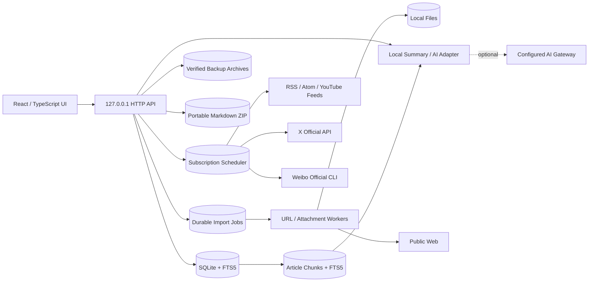

# Reader 架构说明

## 设计目标

Reader 把“本地数据是事实来源”作为首要约束。任何收藏、编辑、标签和阅读进度都应先成功写入 SQLite，再让界面呈现成功状态。网络导入和 AI 是可替换的增强能力，不应阻塞离线阅读。

## 运行结构

生产构建由 Electron 主进程启动随机回环端口的本地服务，再由沙箱化渲染进程加载静态界面和 `/api`。应用包中的 `dist` 只读，SQLite、附件与备份写入 `Application Support/Reader/ReaderData`，升级应用不会覆盖资料。数据模型和 API 仍保持独立边界，便于未来用 SwiftUI/WKWebView 逐模块替换。

## 数据模型

- `articles`：统一承载网页、Markdown、RSS、PDF 元数据和未来附件记录。
- `collections`：使用 `parent_id` 形成树形目录。
- `smart_collections`：保存可验证的规则 JSON 与用户排序；文章仍只存在于原资料夹。
- `tags` / `article_tags`：多对多标签。
- `sources`：订阅配置与运行状态；包括固定同步频率、下次运行、ETag/Last-Modified、平台用户 ID、增量游标、限流状态、连续失败、HTTP 状态和最近导入数。
- `highlights`：正文选区原文、渲染文本偏移、颜色和批注；随文章级联删除并进入数据库完整备份。
- `notes`：为后续独立卡片式笔记预留。
- `attachments`：文件名、MIME、大小、SHA-256 和安全存储名；文章与文件一对多。
- `import_jobs`：任务载荷、状态、尝试次数、错误和结果文章；运行中断后回到等待状态。
- `article_revisions`：文章内容字段的不可变快照；恢复旧版本时追加新快照而不改写历史。
- `article_search`：FTS5 虚拟表，由触发器与文章表保持一致。
- `article_chunks` / `chunk_search`：按 Markdown 标题和段落生成的本地检索片段，以及由触发器维护的 FTS5 索引；记录原文偏移、内容哈希和稳定引用 ID。
- `schema_migrations`：记录已经提交的 schema 版本。
- `schema_migration_audit`：从 schema v9 起保存迁移的固定名称、SHA-256 校验值和应用时间；启动时与代码中的注册表逐项核对。

所有布尔值在 SQLite 中使用 0/1。API 对外转换为 JSON 布尔值，避免前端依赖数据库表示。

## 本地分块检索与引用

文章按 Markdown 标题、自然段和约 900 字符目标长度切分，单片段不超过 1,400 字符。片段保留标题、原文起止偏移和 SHA-256；文章创建、正文编辑、导入最终化和历史版本恢复都在同一 SQLite 事务中替换对应索引。Schema v5 升级时只回填尚未建立片段的文章。

问答先在本机执行候选检索：拉丁文字使用 FTS5，中文使用受限词组匹配，再按标题、摘要、段落标题、正文覆盖率和位置排序。候选必须达到相对分数与词组覆盖阈值；没有足够证据时返回“证据不足”，不会用文章开头或弱相关片段冒充引用。

本地模式使用提取式回答并标注 `[1]` 等引用。远程模式也先完成同一套本地检索，只把最多 8 个、每个最多 2,000 字符的命中片段发给网关，不发送整篇文章或整个资料库。界面显示检索范围、索引片段数、实际引用数，并可从引用卡片回到来源文章的定位片段。

资料夹读取使用递归 CTE 计算子树内容数，选择父资料夹时也会包含所有后代内容。移动资料夹会先拒绝自引用与环；删除非系统资料夹时，整棵子树的文章在同一事务中移入目标资料夹，再由外键级联移除目录节点。批量移动、标签、收藏、已读和归档同样在单一事务中提交，避免只更新一部分内容。

Schema v8 的智能资料夹只保存经过规范化的规则，不复制文章或引入第二套归属关系。规则允许组合正文关键词、受限内容类型、标签、来源、原资料夹、阅读/收藏状态、高亮、附件和最多 3,650 天的时间窗口。服务端把每条规则编译为参数化 SQLite 条件，基础条件始终排除归档内容；“任一满足”和“全部满足”只作用于用户规则，不得绕过基础边界。普通资料夹与智能资料夹排序都要求客户端提交完整同级 ID 集合，并在单一事务中重写连续位置，避免碰撞或部分排序。

## 可迁移导出与重复治理

选择性导出不复制数据库私有结构。服务端按用户指定顺序读取内容和附件，在内存中生成标准 Markdown frontmatter，把同源附件 URL 改写为相对路径，并流式输出 ZIP。每个资料包包含 `articles/`、可选的 `attachments/`、说明文件与 `manifest.json`；清单记录 Reader ID、原链接、标签、字节数和既有 SHA-256，方便迁移后核验。单次最多 500 条，附件在归档前重新验证必须位于本机文件目录且真实存在。

重复检测只扫描活动内容，最多读取最近 5,000 条。规范化原链接、完整正文哈希以及标题与摘要哈希作为高置信证据，经并查集聚合成重复组，不使用模糊模型自动删除内容。处理时用户必须选择保留版本；同一事务合并标签、收藏、最长摘要和阅读进度，并把其余版本标记为归档。副本的正文、版本历史和附件继续留在本机，误判后可从归档恢复。

## 导入安全边界

网页抓取在发起请求前解析 DNS，并拒绝环回、链路本地、RFC1918、CGNAT、IPv6 ULA 及云元数据地址。每次跳转重新校验，默认超时 15 秒，响应体上限 4 MB，只接受 HTTP/HTTPS。

这是一条可靠的第一道防线，但成熟桌面版还应：

- 使用绑定到已校验地址的连接，进一步降低 DNS rebinding 风险。
- 在隔离进程中解析复杂 HTML、PDF 和媒体元数据。
- 为 MIME、压缩炸弹、超长重定向链和证书异常增加专项测试。
- 对导入来源、时间和内容哈希保留审计字段。

## 一致性与故障恢复

- SQLite 开启 foreign keys、WAL 和 5 秒 busy timeout。
- URL/RSS 使用唯一 URL 去重；写入失败不会覆盖已有文章。
- RSS、YouTube、X 和微博共用单实例同步服务。调度器只领取到期且已启用的来源；相同来源的手动/后台同步共享进行中的任务。
- Feed 成功后按用户频率安排下次运行；HTTP 304 只更新健康状态；失败使用指数退避且不改写用户设置。
- X 连接器只向固定的 `api.x.com` 发起 Bearer 请求，按 `since_id` 增量分页，并让平台限流重置时间参与下次调度。微博连接器不持有 OAuth Token，只以无 shell 参数调用官方 `weibo` CLI 的 JSON 输出。
- UI 请求失败时保留本地视图并显示错误信息，不伪造成功。
- AI 摘要只有成功生成后才写回文章。
- URL 和附件先创建任务，再由单并发后台 worker 处理；空闲时自适应降低轮询频率。
- 附件使用内容哈希生成稳定文章 ID；重复提交不会制造重复文件或附件记录。
- PDF 先在暂存区完成文字抽取，再原子移动到文件区；worker 在移动后中断也可以幂等重试。
- schema v8 是不可变 bootstrap，v9 及后续版本只允许追加到显式迁移注册表。检测到旧 schema 时，Reader 会在执行任何新建表或迁移 SQL 前使用 `VACUUM INTO` 创建权限为 `0600` 的一致性数据库快照，并通过 `integrity_check` 后才继续。每个待执行版本使用独立的 `BEGIN IMMEDIATE` 事务，同时写入版本号和迁移审计；任一 SQL 失败时，该版本的结构、版本号与审计记录一起回滚。启动完成前还会校验迁移版本连续、目标版本准确，以及已发布名称和 SHA-256 未被改写。快照以受限文件名枚举，可在数据安全中心查看和导出，API 不返回真实磁盘路径。高于当前应用支持版本或审计历史不匹配的资料库会停止打开，避免不兼容代码继续写入。
- 0.18.1 增加显式触发的只读资料库体检：执行 SQLite `integrity_check`、`foreign_key_check`、迁移历史核对、数据库权限检查、附件记录/文件大小对账和分块索引覆盖检查。响应只包含状态、数量、耗时和数据库字节数，不返回记录内容、附件名、存储名或路径。默认数据目录在启动时固定为 `0700`，数据库及现有 WAL/SHM 固定为 `0600`。
- 完整备份通过 `VACUUM INTO` 取得一致 SQLite 快照，归档中带数据库与附件 SHA-256 清单。
- 恢复包拒绝绝对路径、路径穿越、符号链接、未知顶层路径、超大条目和压缩炸弹；校验通过后才写入待恢复标记。
- 数据库和附件只在下次启动、数据库连接建立前原子替换；安排恢复时会额外创建一份恢复前安全备份。

## Readability 与网页资源本地化

URL worker 使用 Mozilla Readability 在不执行页面脚本的 DOM 中提取正文，再用 Turndown 转换为 GFM Markdown。正文图片先替换为内部令牌，文章创建后逐张经过安全下载并改写为同源附件 URL；首个版本快照只保存最终内容，不暴露内部令牌。

微信公众号页面使用独立的静态 DOM 提取路径，读取公众号账号、作者、标题、`#js_content` 正文和 `data-src` 延迟加载图片，不执行微信脚本。若响应被重定向到环境验证页，导入明确失败且不创建文章。启动时会识别旧版误存的验证页 URL：同一原链接只保留一条可修复记录，多余副本归档而不删除；成功重导后旧内容作为文章版本保留。

Open Graph / Twitter Card 代表图片和最多 16 张正文图片会进入本地化流程。每次请求和跳转都经过与正文相同的 SSRF 校验；单张限制 12 MB、单篇预算 48 MB，并同时校验声明 MIME 与文件魔数。成功后以 SHA-256 稳定命名写入 `data/files/` 并创建附件记录。下载失败不会让正文导入失败，也不会在阅读时自动加载远程图片：图片会降级为明确的在线链接，文章标记为部分离线或仅正文离线。

## 本地缩略图

图片和 PDF 的列表缩略图由本机进程按需生成。图片在解码后检查像素上限并居中裁切；PDF.js 只渲染第一页且禁用动态求值。输出固定为 640×360 WebP，以附件 SHA-256 和渲染版本命名写入 `data/thumbnails/`，并通过同源私有端点提供。并发请求共享同一个生成任务。视频不复制或转码，WebKit 通过支持 Range 的本地媒体端点读取首帧。缩略图是可再生缓存，不进入备份，恢复资料库后会清空。

## Markdown 写作图片

编辑器图片使用独立的文章级流式端点，不经过会创建独立内容条目的通用附件队列。单张上限 20 MB，文件先写入权限为 `0600` 的随机暂存文件，再校验允许的 MIME 和 PNG/JPEG/WebP/GIF/AVIF/HEIC 文件签名。通过 SHA-256 生成稳定存储名；同一文章重复上传相同字节时复用现有附件记录，全资料库相同字节共用磁盘文件。

上传成功后界面把同源附件 URL 作为 Markdown 图片语法插入当前光标处。资源带列出原文章全部图片，可重复插入但不提供物理删除，因为旧文章版本仍可能引用这些附件。编辑器在停止输入 1.4 秒后写入 SQLite；每次正文变化继续追加文章版本，因此自动保存和手动完成都可从版本历史恢复。

## 加密备份格式

明文 `.readerbackup.zip` 继续兼容。启用口令后，Reader 先在权限为 `0600` 的暂存区创建已带 SHA-256 清单的完整 ZIP，再使用随机 16 字节 salt、scrypt（N=65536、r=8、p=1）派生 256 位密钥，并以随机 96 位 IV 和 AES-256-GCM 对整包加密。固定格式头作为 AAD 参与认证，128 位认证标签附在文件末尾。

恢复加密备份时先验证 GCM 标签，再解压并执行原有路径、体积、附件哈希和 SQLite 完整性检查。错误口令与任何密文篡改得到相同的失败结果；口令不会写入数据库、manifest、日志或待恢复标记。解密明文只存在于权限受限的恢复暂存目录，校验后立即删除。

## Mac 桌面边界

0.18 的 Electron Mac 外壳提供单实例、原生菜单、Dock 生命周期、隐藏式标题栏、系统另存为、外链交给默认浏览器，以及沙箱化 preload 的固定命令桥。渲染进程关闭 Node integration、启用 context isolation 与 sandbox；权限请求统一拒绝，导航只信任启动时生成的精确本地 origin。

发行流水线分别构建 x86_64 与 arm64 应用，再用项目内的流式 Mach-O 合并工具生成通用主程序和 Helper；两套 `@napi-rs/canvas` 原生模块按架构保留在独立包路径，由运行时选择。Electron 压缩包必须匹配依赖自带的官方 SHA-256 清单。合并后执行 ad-hoc 深度签名、严格验证，并生成带“应用程序”快捷方式且通过 `hdiutil verify` 的压缩 DMG。

0.18 延续 Intel/Apple Silicon 通用 DMG 流水线，并提供基于 `@electron/osx-sign` 与 Apple `notarytool` 的条件式正式发行入口：配置 Developer ID 身份与 Keychain 公证 profile 后，流水线启用 hardened runtime、提交 DMG、装订并验证公证票据。当前机器没有相应证书与凭据，因此实际交付仍为 ad-hoc，正式公开发行仍需：

- Apple Developer ID 签名、公证和自动更新。
- Share Extension、Spotlight、系统通知和更完整的文件导入器。
- 睡眠/唤醒、低电量和网络切换下的后台调度策略。

当前构建宿主为 Intel Mac，因此 x86_64 切片已实际启动；arm64 Electron 与 Canvas 切片完成官方哈希、Mach-O 架构及签名结构验证，仍应在 Apple Silicon 真机上补运行验收。

## 附件读取

附件不直接暴露真实磁盘路径。界面只拿到 `/api/attachments/:id/content`，服务端根据数据库中的安全存储名解析文件。端点强制 `nosniff`、私有缓存和 inline disposition，并实现标准单区间 Range 响应，供视频拖动和 PDF 查看使用。
