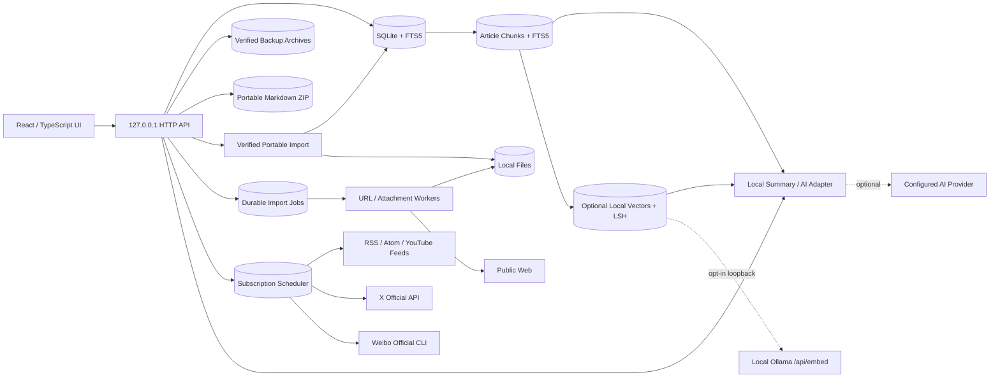

# Reader 架构说明

## 设计目标

Reader 把“本地数据是事实来源”作为首要约束。任何收藏、编辑、标签和阅读进度都应先成功写入 SQLite，再让界面呈现成功状态。网络导入和 AI 是可替换的增强能力，不应阻塞离线阅读。

## 运行结构

生产构建由 Electron 主进程启动随机回环端口的本地服务，再由沙箱化渲染进程加载静态界面和 `/api`。应用包中的 `dist` 只读，SQLite、附件与备份写入 `Application Support/Reader/ReaderData`，升级应用不会覆盖资料。数据模型和 API 仍保持独立边界，便于未来用 SwiftUI/WKWebView 逐模块替换。

0.54.0 在回环服务的统一请求入口加入浏览器来源边界。默认 `127.0.0.1` 模式从已监听 socket 取得本轮随机端口，要求 HTTP `Host` 精确等于该 authority；请求带 `Origin` 时必须等于同一随机 origin，带 `Sec-Fetch-Site` 时只接受 `same-origin` 或顶层导航的 `none`。校验位于 URL 解析、路由、请求体读取和数据库访问之前，因此 DNS rebinding、跨 origin 表单/fetch 和伪造 Fetch Metadata 都不能触达读写 API。Electron、Share 文件桥和本机测试使用精确回环地址；不带浏览器来源头的同机 Node/CLI 调用保持兼容。显式改变 `READER_HOST` 会离开这项默认回环边界。

0.55.0 移除上述可绕过监听边界：服务构造只接受精确 `127.0.0.1`，包括 `0.0.0.0`、主机名与 IPv6 在内的其他值都会在创建数据目录、打开 SQLite、启动后台服务或创建监听 socket 之前失败。桌面主进程继续显式使用随机 IPv4 回环端口，源码服务入口即使收到非回环 `READER_HOST` 也不能把无账号 API 暴露到局域网或公网。最终包门禁会主动注入 `READER_HOST=0.0.0.0`，并要求候选 App 的实际 origin 仍为 `127.0.0.1`。

0.56.0 在同一 HTTP 入口为成功、错误、静态文件与流式响应统一设置浏览器安全头。CSP `frame-ancestors 'self'` 与 X-Frame-Options `SAMEORIGIN` 拒绝跨源嵌入但保留阅读器用同源 `<object>` 显示 PDF；CORP 与 COOP 固定为 `same-origin`，Permissions Policy 禁止相机、地理位置和麦克风，Referrer Policy 为 `no-referrer`，并对所有 MIME 使用 `nosniff`。这些头在 Host/Origin/Fetch Metadata 校验之前写入，因此拒绝响应也保持相同边界；HTML 内现有完整 CSP 继续约束脚本、样式、图片、媒体、连接、frame、base 与表单。

0.58.0 把本地服务关闭改为 single-flight quiescing。首次 `close()` 同步让 HTTP server 停止接受新连接，再并行等待已经进入的请求以及导入、订阅、Spotlight、语义索引和自动备份按既有事务语义完成；不缩短 2 GB 导入/备份边界，也不使用 `closeAllConnections` 强杀活动连接。普通退出、渲染器故障的安全退出和正式更新安装即使并发触发，也共享同一关闭 Promise，组件停止、`app_stopped` 诊断和日志 flush 只执行一次。即使后台组件停止失败，HTTP close 仍在 `finally` 中等待完成，避免退出路径重新开放 listener。

0.59.0 把下载完成提示、菜单手动检查和重复的 `update-downloaded` 事件收敛到同一安装协调状态。提示进行中时所有入口复用同一 Promise；用户选择“稍后”或安装前安全关闭失败后会释放状态，允许再次确认。用户确认且安全关闭成功后，本轮只调用一次 `quitAndInstall()`，后续入口不再重复弹窗或重复安装。若系统 updater 在后台已经完整停止后同步拒绝启动，Reader 立即调用正常 App 退出流程，不保留一个界面仍在但本地服务已停止的失效进程。

0.60.0 收紧正式更新的本机信任前提。运行时不再仅用 `codesign --display` 读取可残留在无效包上的 authority 元数据，而是先对当前主 App 运行 `codesign --verify --deep --strict --verbose=4`；完整包验证成功后才读取 Developer ID Application authority 与有效 Team Identifier。验证或元数据读取任一步失败都不会设置更新 feed、创建检查定时器或联系更新服务。两步检查继续使用固定可执行文件、10 秒超时与 256 KiB 输出上限；有效 ad-hoc 包仍因缺少 Developer ID 身份保持离线。

0.61.0 把桌面退出的更新入口 quiescing 提前到本地服务 drain 之前。`closeReader()` 首先停止更新检查定时器并移除 updater 事件监听，再停止电源/网络后台协调，最后等待已经进入的 HTTP 请求与资料库后台事务自然完成；长导入、备份或索引收尾期间不会再接收下载完成事件或弹出新的安装提示。controller 引用只在 server close 成功后清空，因此由更新安装触发的关闭若失败，既有下载状态仍可按 0.59 的规则再次确认。

0.62.0 为 `SettingsStore` 增加进程内保存事务队列。AI、导入暂停、通知、自动恢复点、Spotlight 和语义检索设置不再各自从可能过期的完整快照并发写入；每次操作会在前一操作结束后读取最新内存状态、生成下一状态，再沿用既有的私有临时文件与原子 rename 持久化，最后同步更新内存。调用自身仍收到写入错误，但用于排队的失败会被消费，后续设置保存可以继续。格式继续为 version 1，权限继续为 `0600`，不需要 schema 或设置迁移。

0.63.0 在 `AISettingsManager` 增加独立的跨存储变更队列。`update` 与 `reset` 按调用顺序串行覆盖读取当前配置、修改 Keychain、保存非密钥设置和更新运行中 AI 服务的完整过程，避免并发操作按异步完成时序倒置最终提供商、端点或密钥。普通更新继续沿用既有设置写盘失败补偿；重置现在也先保存可恢复的当前状态，并在删除密钥后设置重置失败时尽力写回原 Keychain。失败 Promise 不会污染队列，下一项变更仍可执行。由于设置文件和 Keychain 是两个独立系统，补偿写入本身失败时无法宣称绝对原子性；对应调用会保持失败，不静默报告成功。

0.64.0 把同一队列扩展为 AI 配置对外读取的线性化屏障。设置 GET、连接测试和模型目录会先等待调用时已经进入队列的变更完成，再同时解析非密钥设置和 Keychain；因此在“凭据已替换、设置文件尚未提交”的窗口内，不会组合旧端点与新密钥。运行中 `AIService` 仍持有变更前的完整内存快照，提交成功后才整体配置为新状态。`apply()` 使用内部 `publicSettingsSnapshot()` 返回当前事务结果，不反向等待包含自身的队列；外部 `publicSettings()` 才等待队列，避免自等待死锁。

1.0.1 候选保留与应用运行时分离的最小 macOS 源码门禁。`.github/workflows/ci.yml` 只在 `main` 推送及面向 `main` 的 pull request 中运行，使用 Node.js 24 依次执行确定性安装、生产依赖审计、Node 测试和 TypeScript/Vite 构建。它不持有写入权限、签名身份、公证凭据、发布令牌或用户数据，也不承担打包和发行职责；因此 CI 故障不会改变本机资料库或发行物。

0.35.0 在打包元数据中注册唯一的 `reader-local` URL scheme，作为浏览器、快捷指令和 Share Extension 的外部保存边界。主进程在 `ready` 前监听 macOS `open-url`，并同时从冷启动/第二实例 argv 中提取候选。URL 路径只接受 `reader-local://add`、唯一 `url` 参数、最长 2,048 字符且不含用户名或密码的 HTTP(S) 目标。未知动作、重复/额外参数、外层 fragment、其他目标协议和畸形输入直接忽略。

0.45.0 在同一动作下增加与 URL 互斥的唯一 `text` 参数。扩展把最多 4,096 UTF-8 bytes、非空且不含禁止控制字符的文本编码为无 padding 的规范 Base64URL；Electron 主进程严格解码、执行 fatal UTF-8 与重新编码一致性检查，preload 再次验证请求形状、字节数和控制字符。混合、重复、额外、非规范或超限参数均被拒绝。

0.47.0 再增加与 URL/文本互斥的唯一 `file` 参数，但该参数只接受扩展生成的小写规范 UUID v4。深链不携带路径、文件名、MIME、大小、摘要或文件内容；主进程和 preload 各自重新验证 token。普通网页可以尝试唤起添加窗口，但不能借此指定任意本机路径或使用通用文件 IPC。

合格请求最多在主进程和 preload 各排队 20 个，只有渲染器完成加载后才通过单向 `reader:add-request` IPC 送入页面。preload 不公开任意 IPC 发送、文件系统或网络能力；React 逐个把 URL 预填到既有导入页，把文本原样预填到标题为“分享的文本摘录”的 Markdown 页，或用文件 token 请求主进程返回受限名称/大小/MIME。用户仍需选择资料夹并明确提交。URL/文本深链处理本身不调用本地 API、不解析 DNS、不创建导入任务或文章；文件只在扩展私有缓存产生临时副本，确认前同样不创建 SQLite 记录或导入任务。URL 提交后继续复用服务端 `assertPublicURL`，文件确认后继续复用既有同源附件上传端点，因此外部入口不会绕过 SSRF、格式、大小或队列边界。

0.37.0 为每个主窗口监听 Electron `render-process-gone`。初次文档尚未成功加载、窗口已替换、退出流程中或同一恢复提示仍在处理时不会重复介入；已加载界面异常退出后，主进程先停止向失效渲染器交付外部 URL，再异步显示原生选择。用户确认重新载入时只调用当前 `webContents.reload()`，回环服务、SQLite、导入 worker 和订阅调度继续运行；新文档触发 `did-finish-load` 后恢复 IPC 队列。选择退出则复用既有 `before-quit` 顺序，先停止后台任务并刷新诊断，再结束进程。恢复控制器不会同步重载，避免在崩溃事件回调栈内再次触发浏览器进程故障。

0.38.0 把系统通知限制在 Electron 主进程。`settings.json` 中新增默认关闭的 `notifications.enabled`，旧设置文件或类型不正确的值都按关闭处理；设置 API 只接受严格布尔值。导入 worker 一轮最多处理 20 项，结束时只把 `{ completed, failed }` 交给服务端回调；服务端再次检查实时 opt-in 后才交给主进程。主进程仅在 Reader 非前台、系统支持通知且应用未退出时创建静默通知，并在新通知出现前关闭同一控制器的上一条。通知正文由固定模板与 0–99 的计数构成，不接收任务对象、标题、URL、文件名、错误、路径、记录 ID 或资料夹。点击通知只聚焦/重建主窗口并通过既有单向 IPC 打开导入队列。

0.39.0 增加独立专注阅读窗口。工作区只通过 preload 暴露的 `openArticleWindow(articleId)` 请求主进程；主进程先验证发送 frame 仍来自当前随机回环 origin、ID 为最长 200 字符且不含控制字符，并向 SQLite 确认文章存在。每个文章 ID 对应一个 `BrowserWindow`，重复打开只恢复并聚焦现有窗口；不同文章可并行阅读。窗口沿用相同沙箱、上下文隔离、权限拒绝和导航边界，使用受控查询参数加载同一 React 构建。渲染器复用正文、附件和高亮显示组件，但以显式只读模式关闭收藏、资料夹、归档、标签、历史、编辑、AI、阅读进度和批注写入；来源回链只允许打开另一个受验证的专注窗口。“返回资料库”聚焦主窗口；主窗口已关闭时先按既有安全配置重建。任一 Reader 窗口在前台时都抑制后台导入通知。

0.40.0 在同一系统通知边界内加入自动订阅批次。设置新增独立且默认关闭的 `notifications.sourceSyncEnabled`；旧设置缺失字段、类型错误或读取失败都保持关闭，更新任一通知开关时原子保留另一项。调度器在一轮到期来源结束后只生成 `{ imported, failed }`，不携带来源、内容、URL、ID、错误或凭据；服务端在回调当刻读取 opt-in，手动 `POST /api/sources/:id/sync` 不经过该回调。全零批次不显示通知，计数在固定模板中限制为 0–99。点击通知只聚焦或重建主窗口，再经既有受限单向命令打开“内容来源”；任一主窗口或专注窗口在前台时仍统一抑制。

0.41.0 增加显式 opt-in 的 Core Spotlight 桥。Electron 不直接链接原生框架；发行构建先把 Swift helper 分别编译为 x86_64/arm64，再合并为嵌套、无 Dock 图标的 Universal `.app`，由最终 App 深度签名覆盖。服务端只通过 stdin 发送至多 100 条 JSON，helper 只继承固定 `PATH`/`LANG`，命令行和进程环境都不携带正文。helper 使用 `completeUntilFirstUserAuthentication` 保护级别和 Reader 专属命名 index/domain，系统结果由 helper 转成受限 `reader-local://open?article=<id>`；主进程再次校验 scheme、action、唯一参数、长度、控制字符和数据库存在性后打开只读专注窗口。

schema v11 新增 `spotlight_outbox`，文章可索引字段、归档状态和标签的触发器以每文章单行、单调 revision 记录 `upsert/delete`。服务只在设置明确开启时轮询，批次成功后按 `(article_id, revision)` 条件确认；处理中再次编辑会留下更高 revision，helper 超时、退出、无效响应或 Core Spotlight 失败都不会丢队列或阻断 Reader。启用会重新排队全部文章；停用必须先删除 Reader domain，确认成功后再清空 outbox 并原子保存关闭状态。

0.42.0 增加嵌入 `Contents/PlugIns` 的 macOS Share Extension；0.45.0 把 strict matching 激活规则从单个 `public.url` 扩展为单个 URL 或单段文本。Swift 构建分别面向 x86_64/arm64，再合并为 bundle ID 受宿主前缀约束的 Universal `.appex`。扩展以普通 `NSViewController` 提供短暂、可访问的交接状态，通过异步 `NSItemProvider` 优先读取 URL，否则读取纯文本；独立 Swift 校验器分别限制为最长 2,048 字符、无控制字符/用户名/密码的 HTTP(S) 地址，或最多 4,096 UTF-8 bytes、非空且不含禁止控制字符的文本，再构造唯一 `reader-local://add?url=...` 或规范 Base64URL `reader-local://add?text=...` 并交给 `NSWorkspace`。扩展不联网、不读写文件、不访问 SQLite、Keychain、UserDefaults 或 App Group；系统选择扩展是第一次用户动作，Reader 既有添加窗口仍是最终写入确认。

最终签名不再依赖无差别 `codesign --deep` 保存扩展权限：流水线先处理全部嵌套代码，再用只含 `com.apple.security.app-sandbox` 的 entitlement 重新签名 `.appex`，最后带主程序最小 `allow-jit` entitlement 重签宿主并执行深度严格验证。Developer ID 路径禁用自动 entitlement 补全并按文件选择权限，Spotlight helper 与 Transcription helper 使用空权限，Share Extension 精确使用 sandbox，Electron helper 保留各自运行所需默认项；构建门禁回读主程序和三个原生子 bundle 的精确权限集合，拒绝额外 App Group 或未使用的硬件权限。

0.47.0 把 strict matching 扩展到单个文件。Apple 的 `NSItemProvider.loadFileRepresentation` 临时副本会在回调返回时删除，因此扩展在回调内把受支持的 PDF、PNG/JPEG/GIF/WebP/HEIC、MP4/MOV/M4V/WebM、Markdown 或纯文本复制到自己的 `Caches/ReaderShareStaging`。目录/文件权限固定为 `0700/0600`，文件非空且最多 100 MB；随机 UUID v4 对应一个 `.payload` 和最后原子写入的固定 schema `.json`，记录受控文件名、MIME、精确字节数、SHA-256 与创建时间。扩展启动时删除超过 24 小时的成对暂存，打开 Reader 失败时立即删除本次副本。

Electron 主进程只从当前用户固定的 Share Extension 容器解析 token，不接受渲染器提供路径。检查过程以 `O_NOFOLLOW` 打开描述与载荷，拒绝符号链接、非普通文件、组/其他用户可读权限、未知字段、过期/未来时间、大小或 SHA-256 不符及服务端不支持的类型；渲染器只获得冻结的 token、显示名、大小和 MIME。确认后主进程从已经验证的文件描述符流式写入随机回环附件端点，服务端再次执行 100 MB、文件名、MIME、图片签名与队列校验。成功、取消或切换入口都会清理暂存；传输失败保留原副本供当前用户重试，最迟由 24 小时清理回收。该方案不增加 App Group、网络、书签或用户文件 entitlement。

## 数据模型

- `articles`：统一承载网页、Markdown、RSS、PDF 元数据和未来附件记录。
- `collections`：使用 `parent_id` 形成树形目录。
- `smart_collections`：保存可验证的规则 JSON 与用户排序；文章仍只存在于原资料夹。
- `tags` / `article_tags`：多对多标签。
- `sources`：订阅配置与运行状态；包括固定同步频率、下次运行、ETag/Last-Modified、平台用户 ID、增量游标、限流状态、连续失败、HTTP 状态和最近导入数。
- `highlights`：正文选区原文、渲染文本偏移、颜色和批注；随文章级联删除并进入数据库完整备份。
- `notes`：为后续独立卡片式笔记预留。
- `attachments`：文件名、MIME、大小、SHA-256 和安全存储名；文章与文件一对多。
- `import_jobs`：任务载荷、状态、尝试次数、错误和结果文章；运行中断后回到等待状态。
- `article_revisions`：文章内容字段的不可变快照；恢复旧版本时追加新快照而不改写历史。
- `article_search` / `article_search_trigram`：分别承载拉丁文字词法检索与三个及以上字符的中文子串检索，由独立触发器与文章表保持一致。
- `article_chunks` / `chunk_search`：按 Markdown 标题和段落生成的本地检索片段，以及由触发器维护的 FTS5 索引；记录原文偏移、内容哈希和稳定引用 ID。
- `chunk_embeddings` / `chunk_embedding_buckets`：schema v12 增加的可选本地 Float32 单位向量和 16 组 LSH 桶；两者都是可删除、可重建的派生索引，通过外键随片段编辑或删除自动失效。
- `schema_migrations`：记录已经提交的 schema 版本。
- `schema_migration_audit`：从 schema v9 起保存迁移的固定名称、SHA-256 校验值和应用时间；启动时与代码中的注册表逐项核对。

所有布尔值在 SQLite 中使用 0/1。API 对外转换为 JSON 布尔值，避免前端依赖数据库表示。

## 本地分块检索与引用

文章按 Markdown 标题、自然段和约 900 字符目标长度切分，单片段不超过 1,400 字符。片段保留标题、原文起止偏移和 SHA-256；文章创建、正文编辑、导入最终化和历史版本恢复都在同一 SQLite 事务中替换对应索引。Schema v5 升级时只回填尚未建立片段的文章。

问答先在本机执行候选检索：拉丁文字使用 FTS5，中文使用受限词组匹配，再按标题、摘要、段落标题、正文覆盖率和位置排序。候选必须达到相对分数与词组覆盖阈值；没有足够证据时返回“证据不足”，不会用文章开头或弱相关片段冒充引用。

本地模式使用提取式回答并标注 `[1]` 等引用。远程模式也先完成同一套本地检索，只把最多 8 个、每个最多 2,000 字符的命中片段发给网关，不发送整篇文章或整个资料库。界面显示检索范围、索引片段数、实际引用数，并可从引用卡片回到来源文章的定位片段。

0.48.0 在既有 Reader Gateway action 契约旁增加统一的提供商注册表。`reader-gateway` 继续把结构化 action 直接 POST 到用户端点；`openai`、本机 `ollama` 与自定义 `openai-compatible` 则共享最小 Chat Completions 适配器，以 system 消息冻结任务 JSON 契约、把既有受限 payload 作为不可信来源数据发送，并要求 JSON object 响应。OpenAI 与 Ollama 的基础地址固定为官方 HTTPS 或 `127.0.0.1` 回环值；自定义基础地址继续执行 HTTPS/回环 HTTP、无用户信息、无片段、无密钥查询参数和无查询字符串校验。服务端只接受受限模型 ID，并把实际响应模型写入既有来源记录。

模型目录不是启动任务。用户点击“读取模型”后，服务端才对同一 OpenAI-compatible 基础地址发起 `GET models`，沿用 60 秒和 2 MB 响应边界，只保留前 500 个合法、去重、排序后的 `{ id, ownedBy }`；请求不含文章、检索片段或其他资料库数据。提供商、规范化端点和模型保存在权限为 `0600` 的 `settings.json`，API 密钥仍只进入 Keychain。密钥作用域由提供商与规范化端点共同确定：候选测试/目录只有作用域完全相同时才可复用已存密钥；切换作用域且未提供新密钥时，保存会删除旧 Keychain 项，防止把一个服务的凭据发送给另一个服务。所有 AI Fetch 都设置 `redirect: error`，配置必须直接指向最终端点。

0.49.0 增加与远程生成配置彼此独立、默认关闭的本地语义检索。嵌入客户端只允许固定 `http://127.0.0.1:11434/api/embed`，不接受可配置主机、不发送认证头、拒绝重定向，并按最多 16 段、每段最多 2,000 字符、120 秒、8 MB 响应和 8–4,096 维有限浮点向量校验 Ollama 批次。模型测试只发送 Reader 内置英文；用户明确启用后，后台服务才领取尚未嵌入的活动片段。模型请求设置 `truncate: false`，避免服务静默截断已经由 Reader 限定的片段。

Schema v12 将单位化 Float32 向量保存为长度必须等于 `dimensions × 4` 的 BLOB，并为每个片段生成 16 个确定性稀疏随机投影桶。查询只从 `(model, band, bucket)` 索引命中的至多 1,500 个候选读取向量，再计算精确余弦相似度；因此不会为每次提问扫描整个向量库。结果与最多 12 个现有词法候选使用等权 reciprocal-rank fusion 混排，共同命中的片段自然优先，纯语义首位仍能进入有限结果。查询嵌入失败、模型维度变化或索引暂不可用时返回词法回退模式，不阻断问答；同名模型维度变化会清空并重建全部派生向量，避免混用空间。

0.50.0 在不改变 schema 和向量事实边界的前提下增加两层质量保护。模型测试用一个批次发送 9 句 Reader 固定短句，组成中文、英文与跨语言三组 anchor/positive/negative；只返回通过数、总数、平均余弦 margin 和 `strong/partial/poor` 聚合等级，不读取或回传资料库内容。该结果是本次进程内的选型提示，不作为完整模型基准，也不阻止用户选择特定模型。查询端为每个 band 保留精确桶，并按投影绝对值选择两个最低置信位分别翻转，形成三个互异桶；SQL 仍只读取同一模型的活动片段并把候选限制为 1,500，最终排序仍由完整向量精确余弦决定。确定性 200 对近邻回归集要求多探针召回严格高于精确桶且达到 200/200，10,003 片段性能门禁继续限制 p95 不高于 250 ms。

片段 ID 已包含正文哈希。后台嵌入完成后只在片段 ID 与 `content_sha256` 仍匹配时事务写入向量和完整 16 桶；编辑、恢复或删除文章会先替换片段，外键级联删除旧向量。关闭语义检索会等待当前批次稳定结束、删除全部向量和桶，再保存关闭状态。全文/RAG 受控修复重建权威片段时同样通过级联清空向量，启用状态下随后重新领取。索引任务在睡眠、低电量、严重热/降频和资料恢复锁下暂停，但离线不会阻止固定回环 Ollama。

资料夹读取使用递归 CTE 计算子树内容数，选择父资料夹时也会包含所有后代内容。移动资料夹会先拒绝自引用与环；删除非系统资料夹时，整棵子树的文章在同一事务中移入目标资料夹，再由外键级联移除目录节点。批量移动、标签、收藏、已读和归档同样在单一事务中提交，避免只更新一部分内容。

0.22.0 的资料列表按 `(created_at, id)` 倒序使用不透明游标分页，时间相同的记录仍有确定顺序；API 同时返回筛选后的准确总数和下一页状态。schema v10 为归档、未读、收藏、类型与资料夹视图增加匹配排序的复合索引，并用 FTS5 trigram 替换三个及以上字符中文查询的全表 `LIKE` 扫描。界面每页加载 100 条，快速切换查询时以请求代次丢弃过期响应，追加页面按文章 ID 去重；后台状态刷新不再重置用户已经加载的页面。

0.23.0 把列表和详情拆成明确的传输契约。`listArticlePage({ includeContent: false })` 使用显式列投影返回除 `content` 外的文章摘要；既有数据库数组调用默认仍返回全文，HTTP 列表端点则始终选择摘要模式。前端列表只保存 `ArticleSummary`，选中 ID 后单独调用详情端点，并用请求代次丢弃快速切换产生的过期正文；编辑、标记已读和新建内容会同时更新摘要与当前详情。文章卡片的视觉容器不再承担按钮角色，打开与选择是同级原生按钮；进入批量模式后移除整卡打开按钮，只保留单一选择语义。

0.24.0 在应用根部挂载单一 `DialogAccessibilityManager`，统一管理所有 `[role="dialog"][aria-modal="true"]`。管理器持续记录最近一次位于模态框外的焦点；窗口出现后保留组件自身的 `autoFocus`，否则聚焦第一个可用控件或对话框本身。捕获阶段的键盘处理把 Tab/Shift+Tab 约束在最上层窗口内，Esc 只点击当前窗口中未禁用的既有关闭按钮，因此继续复用编辑器未保存确认和忙碌态禁用等业务边界。窗口替换时保留最初触发器，全部关闭后再恢复焦点；嵌套的非模态高亮浮层不参与这套管理。

0.36.0 补齐 `aria-modal` 的实际交互边界：任一顶层模态框存在时，管理器把 `.app-window` 标记为原生 HTML `inert`；若多个窗口在同一次状态切换中短暂共存，除 DOM 最上层窗口外的其他模态框也进入 inert。这样背景控件不仅在视觉上被遮罩，也不能由鼠标、键盘、程序化菜单焦点或辅助技术继续操作。捕获到意外移出当前窗口的焦点时会立即回到窗口内首个可用控件；所有窗口关闭或管理器卸载时清除 inert，并继续复用原有触发器恢复路径。该变化只作用于渲染器交互树，不改变业务状态、API 或数据格式。

0.25.0 把侧栏的扁平缩进资料夹列表升级为单一焦点的 ARIA tree。服务端资料夹结构和 `flattenedCollections` 顺序不变；界面按本地折叠集合派生可见行，并为每行提供 `aria-level`、`aria-posinset`、`aria-setsize`、`aria-expanded` 和 `aria-selected`。上/下、Home/End 在可见行间移动焦点；右键展开或进入第一个子节点，左键折叠或返回父节点，Enter/Space 复用既有资料夹选择路径。树仍使用原生按钮作为 treeitem，文章拖放目标和点击筛选回调保持原位，折叠状态只属于当前界面会话，不写入用户数据库。

0.26.0 为编辑器和批注现有路径增加可访问状态层，不改变保存协议。编辑器以标题作为初始焦点，捕获 ⌘/Ctrl+S 后调用既有 `persist`，保存状态通过 `role=status` 播报；Markdown 与预览是具名 region，透明文件输入覆盖可见上传标签并用 `:focus-within` 显示焦点。阅读器正文和批注区可获得程序化焦点；高亮入口把焦点移到批注 region，颜色按钮公开 pressed 状态，定位、颜色与批注写回通过隐藏 live region 播报。选区浮层是具名的非模态 dialog，文档级 Escape 关闭后把焦点还给选区发起处；所有高亮 CRUD 仍使用既有本地 API。

0.29.0 为静态正文增加显式的纯键盘选取模式，不把文章变成可编辑控件。开启后正文保持只读 `document`，Reader 用当前 Electron Chromium 的原生 `Selection.modify` 推进 DOM Range：左右方向键按字符、上下方向键按视觉行、Option+方向键按词移动，Shift 把移动扩展为选区；Control+Option 组合不拦截，以保留 VoiceOver 导航。折叠光标和已选原文通过 live status 播报，在支持 CSS Custom Highlight 的运行时额外显示单字符光标标记。Enter 复用既有保存浮层，Escape、保存或取消都会清除 Range 并把焦点还给“键盘选取”按钮。正文从未设置 `contenteditable`，字符输入、删除、粘贴或输入法不会获得修改 DOM 的编辑面；高亮仍只在用户确认后通过既有 API 写入 SQLite。

0.30.0 用共享的 `FilePickerButton` 替换编辑器图片、附件、Reader ZIP、OPML 与备份恢复路径中依赖透明覆盖或微小输入框的文件入口。每个入口以原生可见按钮作为唯一交互面，受信任的点击触发同组件内隐藏的标准 `input[type=file]`，选择完成后只把浏览器提供的 `File` 对象交给既有同源流式上传；Electron preload 不新增路径、文件读取或任意 IPC。处理函数在清空 input 之前建立请求体，使立即上传不依赖选择器继续保留文件句柄，同时仍允许再次选择同一个文件。

0.31.0 把仅由 `active` class 表达的状态同步到辅助技术：资料库、智能资料夹与标签导航使用 `aria-current`；内容筛选、文章助手功能、检索范围、添加类型、智能规则匹配、重复组和文章批量选择使用 `aria-pressed`；版本预览公开当前项。文章打开与选择按钮通过同一隐藏描述关联已经加载的摘要字段，包含已读/收藏、来源、日期、类型、资料夹、最多三个标签和最多 180 字摘要，不读取完整正文；描述节点不会成为额外的浏览文本。视觉结构、按钮行为和 API 均不改变。

0.32.0 把生产路径中的网页 DOM/Readability/Turndown、PDF.js 文本抽取以及图片/PDF 缩略图解码移到一次性解析子进程。父进程只负责经过既有 SSRF/体积/暂存路径校验的输入、数据库事务与最终文件落盘；解析器以当前 Node 或打包 Electron 可执行文件的 Node 模式启动，V8 heap 上限为 256 MB，网页任务 15 秒、文件任务 30 秒，输入输出均有 12 MB IPC 上限，缩略图解码结果另限 2 MB。全局最多同时运行两个解析器、排队 32 个任务，超限直接返回可重试的繁忙错误。

解析子进程只继承语言、时区和临时目录等最小环境，不继承 Reader 或第三方密钥环境变量。目标 Node/Electron 运行时启用 Node permission model：只读应用代码与当前明确的源文件，拒绝文件写入、任意系统文件读取和再次创建子进程。每次 IPC 响应使用随机 nonce 边界，依赖库写入 stdout 的提示不能伪造结果。异常退出、超时、超限或无效响应只使当前导入/缩略图任务失败，父服务与后续解析任务继续运行。图片缩略图需要加载项目自带的原生 Canvas addon，因此该任务额外允许受信任 addon；这不是完整 OS 沙箱，安全收益主要是最小 Node 权限、资源上限和崩溃隔离。

0.33.0 在既有串行后台策略中加入持久化的用户导入暂停原因。队列窗口通过 `PUT /api/import-jobs/state` 只接受布尔值；状态先原子写入权限为 `0600` 的 `data/settings.json`，再暂停 worker，并在运行时切换失败时恢复原偏好。暂停会等待当前已领取任务完成，但不再领取下一项；待处理任务、尝试次数和暂存附件继续留在既有 SQLite/文件队列中。启动时先读取偏好，以暂停态创建 worker，再开放本地服务，因此重启不会短暂领取任务。

用户暂停只作用于导入 worker，不影响来源调度。服务端把它与资料恢复锁、睡眠和系统资源限制按原因集合合并；“继续队列”只移除用户原因，其他原因仍存在时 worker 保持暂停。`/api/health` 同时公开 `importUserPaused`、实际 `importsPaused` 和脱敏原因列表，标题栏与队列窗口据此区分“手动暂停”和系统限制；按钮使用原生 `aria-pressed`，状态变化由 polite live region 播报。

0.34.0 把三栏桌面的视觉 pane 名称映射为浏览器和 macOS AX 可识别的 landmarks：侧栏与文章助手分别是有名称的 complementary，内容区由当前一级标题命名为 region，阅读器 main 的名称随已完成加载的文章标题更新。App 根部保留单一 polite live status，在文章 ID 改变时先播报加载中，详情请求完成后再播报实际标题；传给阅读器和文章助手的详情必须与当前 ID 一致，避免快速切换时短暂暴露上一文章。内容区和阅读器以 `aria-busy` 区分本地读取状态，不改变请求、缓存或焦点路径。

界面通过 `prefers-reduced-motion: reduce` 继承 macOS“减少动态效果”：CSS 动画与过渡缩短为单次近零时长，JS 的高亮/批注定位从平滑滚动切换为即时滚动。运行任务仍由文字状态表达，不依赖旋转动画传递含义；默认视觉和数据行为保持不变。

同版本的十万篇门禁暴露出资料库总览统计会重复扫描文章表。`stats()` 保持原响应字段，但把总数、未读、收藏、笔记和归档改为五个独立标量计数，使 SQLite 分别使用现有 `archived`、`is_read`、`is_favorite` 与 `type` 覆盖索引；不增加 schema 或缓存，也不引入计数失效风险。

Schema v8 的智能资料夹只保存经过规范化的规则，不复制文章或引入第二套归属关系。规则允许组合正文关键词、受限内容类型、标签、来源、原资料夹、阅读/收藏状态、高亮、附件和最多 3,650 天的时间窗口。服务端把每条规则编译为参数化 SQLite 条件，基础条件始终排除归档内容；“任一满足”和“全部满足”只作用于用户规则，不得绕过基础边界。普通资料夹与智能资料夹排序都要求客户端提交完整同级 ID 集合，并在单一事务中重写连续位置，避免碰撞或部分排序。

## 可迁移导入导出与重复治理

选择性导出不复制数据库私有结构。服务端按用户指定顺序读取内容和附件，在内存中生成标准 Markdown frontmatter，把同源附件 URL 改写为相对路径，并流式输出 ZIP。v3 资料包包含 `articles/`、可选的 `attachments/`、`records/` sidecar、说明文件与 `manifest.json`；清单记录 Reader ID、原链接、标签、字节数和既有 SHA-256。标准 Markdown 可独立使用，sidecar 则保存原始正文、摘要、阅读状态和扩展元数据，使 Reader 重新导入时不需要反解析展示型附录。单次最多 500 条，附件在归档前重新验证必须位于本机文件目录且真实存在。

重新导入分成两个明确阶段。预览阶段把 ZIP 流式写入权限受限的随机目录，拒绝绝对路径、路径穿越、反斜杠、符号链接、加密条目、重复/未知文件、超限展开数据和清单不一致，再逐个核对附件大小与 SHA-256。API 只返回不含磁盘路径的 24 小时 token、文章摘要和冲突状态。提交阶段只处理用户明确勾选的 Reader ID，并统一写入用户选择的资料夹；本机已有相同 ID 或原链接时跳过，不覆盖现有文章。附件按内容哈希复用，正文中的旧附件 ID 或相对路径改写为新同源端点；标签、高亮、阅读状态和本地摘要一并恢复。v2 包使用受限 frontmatter 解析与末尾附录剥离进入兼容模式。

重复检测只扫描活动内容，最多读取最近 5,000 条。规范化原链接、完整正文哈希以及标题与摘要哈希作为高置信证据，经并查集聚合成重复组，不使用模糊模型自动删除内容。处理时用户必须选择保留版本；同一事务合并标签、收藏、最长摘要和阅读进度，并把其余版本标记为归档。副本的正文、版本历史和附件继续留在本机，误判后可从归档恢复。

## 导入安全边界

网页抓取只接受 HTTP/HTTPS。0.20.1 开始，每一跳先解析全部 DNS 结果；任一结果属于环回、链路本地、RFC1918、CGNAT、IPv6 ULA、保留地址或云元数据地址即拒绝。连接阶段通过自定义 lookup 只返回本次已经验证的具体 IP，禁用跨请求连接复用，同时继续使用原始主机名生成 Host 并完成 TLS SNI/证书校验。重定向目标重新执行完整解析与绑定，不沿用上一跳地址。

15 秒超时覆盖连接和完整响应体；gzip、deflate 与 Brotli 在解压后继续受 4 MB 正文或 12 MB 图片上限约束。多个已验证公网地址只在连接建立失败时依次尝试，收到响应后的格式、解压或体积错误不会换地址重试。成熟桌面版继续要求：

- 复杂 HTML、PDF 文本和静态图片/PDF 缩略图继续在一次性权限与资源受限进程中解析。
- 为 MIME、压缩炸弹、超长重定向链和证书异常增加专项测试。
- 对导入来源、时间和内容哈希保留审计字段。

## 一致性与故障恢复

- SQLite 开启 foreign keys、WAL 和 5 秒 busy timeout。
- URL/RSS 使用唯一 URL 去重；写入失败不会覆盖已有文章。
- RSS、YouTube、X 和微博共用单实例同步服务。调度器只领取到期且已启用的来源；相同来源的手动/后台同步共享进行中的任务。
- Feed 成功后按用户频率安排下次运行；HTTP 304 只更新健康状态；失败使用指数退避且不改写用户设置。
- X 连接器只向固定的 `api.x.com` 发起 Bearer 请求，按 `since_id` 增量分页，并让平台限流重置时间参与下次调度。微博连接器不持有 OAuth Token，只以无 shell 参数调用官方 `weibo` CLI 的 JSON 输出。
- UI 请求失败时保留本地视图并显示错误信息，不伪造成功。
- AI 摘要只有成功生成后才写回文章。
- URL 和附件先创建任务，再由单并发后台 worker 处理；空闲时自适应降低轮询频率。
- 附件使用内容哈希生成稳定文章 ID；重复提交不会制造重复文件或附件记录。
- PDF 先在暂存区完成文字抽取，再原子移动到文件区；worker 在移动后中断也可以幂等重试。
- schema v8 是不可变 bootstrap，v9 及后续版本只允许追加到显式迁移注册表。检测到旧 schema 时，Reader 会在执行任何新建表或迁移 SQL 前使用 `VACUUM INTO` 创建权限为 `0600` 的一致性数据库快照，并通过 `integrity_check` 后才继续。每个待执行版本使用独立的 `BEGIN IMMEDIATE` 事务，同时写入版本号和迁移审计；任一 SQL 失败时，该版本的结构、版本号与审计记录一起回滚。启动完成前还会校验迁移版本连续、目标版本准确，以及已发布名称和 SHA-256 未被改写。快照以受限文件名枚举，可在数据安全中心查看和导出，API 不返回真实磁盘路径。高于当前应用支持版本或审计历史不匹配的资料库会停止打开，避免不兼容代码继续写入。
- 0.21.0 的快照恢复只接受当前数据目录中通过严格文件名解析得到的本机快照 ID，不接受用户上传任意 SQLite。安排前核对快照目标版本不高于当前应用、实际来源 schema 与文件名一致、`integrity_check`、外键和 SHA-256 均通过；随后复制到权限为 `0700/0600` 的待恢复区，并创建包含当前数据库与全部附件的 `pre-migration-restore` 完整备份。为固定这份备份的时间边界，待恢复期间服务端拒绝写请求，并暂停导入 worker 和订阅 scheduler；取消恢复时统一恢复，读取与资料库检查不受影响。下次启动在数据库打开前再次核对哈希、完整性、外键和 schema，只原子替换 SQLite、保留附件、清空可再生缩略图，再走现有连续迁移与审计。快照以后新增或编辑的数据库记录会从活动资料库消失，但始终保留在恢复前完整备份中；取消任务不会删除该安全备份或原快照。
- 0.18.1 增加显式触发的只读资料库体检：执行 SQLite `integrity_check`、`foreign_key_check`、迁移历史核对、数据库权限检查、附件记录/文件大小对账和分块索引覆盖检查。响应只包含状态、数量、耗时和数据库字节数，不返回记录内容、附件名、存储名或路径。默认数据目录在启动时固定为 `0700`，数据库及现有 WAL/SHM 固定为 `0600`。
- 0.19.1 在体检结果上增加受控修复决策。仅当 SQLite 页结构、外键、迁移审计和附件对账全部通过时，Reader 才允许收紧数据目录/数据库权限，或从 `articles` 权威记录重新生成 `article_chunks`、词法全文 FTS、trigram 子串 FTS 与分块 FTS。索引重建前通过 `VACUUM INTO` 创建包含附件的完整 `pre-repair` 备份，完成后重新执行全套体检；正在导入、已有待重启恢复或另一项修复运行时拒绝开始。API 只返回动作名、脱敏健康汇总和可下载备份元数据，不返回 manifest 或本机路径。
- 结构损坏、外键失效、迁移历史不匹配、附件缺失或大小不符都不进入自动修复。未引用附件只报告警告，不自动删除。修复代码不更新文章、版本、高亮、标签、阅读状态或附件记录；若索引重建失败，修复前完整备份保留，派生索引可在排除故障后重试。
- 0.20 增加独立于 SQLite 的本地诊断日志。日志以权限为 `0600` 的 JSONL 保存在 `data/logs/`，目录为 `0700`；单文件最多 512 KB，最多保留当前文件和两份轮转文件。写入串行化但失败不会阻断主应用，关闭服务前会完成队列落盘。日志目录不进入完整备份、Markdown 导出或任何网络请求。
- 诊断事件使用固定事件注册表和逐事件字段白名单，只覆盖启动/退出、启动失败、完整备份、恢复安排/取消、受控修复及意外本地 API 失败。错误只映射为有限类别，路由只映射为不含 ID 的功能分组；标题、正文、URL、附件名、记录 ID、磁盘路径、错误原文、堆栈和凭据没有可写字段。读取和 JSONL 导出时再次执行同一白名单清洗，手工篡改日志也不能经 API 回显任意字段。意外 5xx 响应统一为通用错误，不把内部异常返回渲染器。
- 0.19 的 Markdown ZIP 导入以文章为故障隔离单位；预览完成前不写 SQLite，提交结果区分导入、冲突跳过和失败。单篇失败时删除刚创建的文章记录并清理没有其他记录引用的新附件文件，成功文章不因另一篇失败而回滚。
- 完整备份通过 `VACUUM INTO` 取得一致 SQLite 快照，归档中带数据库与附件 SHA-256 清单。
- 0.51.0 在同一完整备份格式上增加默认关闭的自动恢复点服务。设置只保存 `enabled` 与更新时间；服务启动、每小时轮询或用户开启时检查是否已超过 24 小时，并在导入任务为空后用 `reason: automatic` 创建明文完整备份。自动文件使用独立 `reader-auto-backup-` 前缀；成功后只在这个严格命名空间内保留最新 3 份，因此手动、加密和各类安全边界备份不进入轮转。服务的单一 active promise 防止重复触发，并让睡眠、低电量、系统限制与恢复锁的统一后台策略等待当前归档结束后再继续。失败只记录脱敏时间状态并在后续轮询重试，不阻断本地服务。
- 0.52.0 收紧 `createBackup` 的成功语义。SQLite 快照先通过 `integrity_check`；ZIP 完成后以 lazy entry 流逐项执行既有路径、符号链接、重复项、条目数和总展开大小边界，并把数据库、精确 manifest 字节与每个附件的真实长度/SHA-256 对回创建清单。只读取流，不再次落盘附件。加密路径先验证明文 ZIP，再把最终 AES-256-GCM 密文认证解密到内存哈希 sink，确认与明文 ZIP 完全相同。成功后写入独立 `0600` 验证凭据；列表凭据无效时只降级为“恢复时校验”，不隐藏旧包。自动恢复点轮转同时删除对应凭据，其他备份与凭据不受影响。
- 恢复包拒绝绝对路径、路径穿越、符号链接、未知顶层路径、超大条目和压缩炸弹；校验通过后才写入待恢复标记。
- 数据库和附件只在下次启动、数据库连接建立前原子替换；安排恢复时会额外创建一份恢复前安全备份。

## Readability 与网页资源本地化

URL worker 使用 Mozilla Readability 在不执行页面脚本的 DOM 中提取正文，再用 Turndown 转换为 GFM Markdown。正文图片先替换为内部令牌，文章创建后逐张经过安全下载并改写为同源附件 URL；首个版本快照只保存最终内容，不暴露内部令牌。

微信公众号页面使用独立的静态 DOM 提取路径，读取公众号账号、作者、标题、`#js_content` 正文和 `data-src` 延迟加载图片，不执行微信脚本。若响应被重定向到环境验证页，导入明确失败且不创建文章。启动时会识别旧版误存的验证页 URL：同一原链接只保留一条可修复记录，多余副本归档而不删除；成功重导后旧内容作为文章版本保留。1.0.1 的 v2 解析器还会把微信表格单元格规整为单行 GFM 单元格、恢复 `<pre>` 内由 ` ` 表示的换行，并在正文已有图片时不再重复导入 Open Graph 封面；旧 v1 微信文章重新导入时原位创建新版本，既有误封面附件仅隐藏而不删除。

Open Graph / Twitter Card 代表图片和最多 16 张正文图片会进入本地化流程。每次请求和跳转都经过与正文相同的 SSRF 校验；单张限制 12 MB、单篇预算 48 MB，并同时校验声明 MIME 与文件魔数。成功后以 SHA-256 稳定命名写入 `data/files/` 并创建附件记录。下载失败不会让正文导入失败，也不会在阅读时自动加载远程图片：图片会降级为明确的在线链接，文章标记为部分离线或仅正文离线。

## 本地缩略图

图片和 PDF 的列表缩略图由本机进程按需生成。图片在解码后检查像素上限并居中裁切；PDF.js 只渲染第一页且禁用动态求值。输出固定为 640×360 WebP，以附件 SHA-256 和渲染版本命名写入 `data/thumbnails/`，并通过同源私有端点提供。并发请求共享同一个生成任务。视频不复制或转码，WebKit 通过支持 Range 的本地媒体端点读取首帧。缩略图是可再生缓存，不进入备份，恢复资料库后会清空。

## Markdown 写作图片

编辑器图片使用独立的文章级流式端点，不经过会创建独立内容条目的通用附件队列。单张上限 20 MB，文件先写入权限为 `0600` 的随机暂存文件，再校验允许的 MIME 和 PNG/JPEG/WebP/GIF/AVIF/HEIC 文件签名。通过 SHA-256 生成稳定存储名；同一文章重复上传相同字节时复用现有附件记录，全资料库相同字节共用磁盘文件。

上传成功后界面把同源附件 URL 作为 Markdown 图片语法插入当前光标处。资源带列出原文章全部图片，可重复插入但不提供物理删除，因为旧文章版本仍可能引用这些附件。编辑器在停止输入 1.4 秒后写入 SQLite；每次正文变化继续追加文章版本，因此自动保存和手动完成都可从版本历史恢复。

## 加密备份格式

明文 `.readerbackup.zip` 继续兼容。启用口令后，Reader 先在权限为 `0600` 的暂存区创建已带 SHA-256 清单的完整 ZIP，再使用随机 16 字节 salt、scrypt（N=65536、r=8、p=1）派生 256 位密钥，并以随机 96 位 IV 和 AES-256-GCM 对整包加密。固定格式头作为 AAD 参与认证，128 位认证标签附在文件末尾。

恢复加密备份时先验证 GCM 标签，再解压并执行原有路径、体积、附件哈希和 SQLite 完整性检查。错误口令与任何密文篡改得到相同的失败结果；口令不会写入数据库、manifest、日志或待恢复标记。解密明文只存在于权限受限的恢复暂存目录，校验后立即删除。

## Mac 桌面边界

0.18 的 Electron Mac 外壳提供单实例、原生菜单、Dock 生命周期、隐藏式标题栏、系统另存为、外链交给默认浏览器，以及沙箱化 preload 的固定命令桥。渲染进程关闭 Node integration、启用 context isolation 与 sandbox；权限请求统一拒绝，导航只信任启动时生成的精确本地 origin。

0.30.0 的窗口启动不再把显示时机完全交给 `ready-to-show` 事件。主进程保持 `show: false` 避免空白闪烁，在本地页面 `loadURL` 成功后检查窗口未销毁并显式 `show()`；打包 App 回归以 CoreGraphics 确认窗口已在屏幕显示，并从最终渲染器确认文档为 visible。文件选择继续使用 Chromium/Electron 的标准系统选择器，不经过 preload 或主进程文件系统桥。

0.31.0 按 Electron 官方方式从外部设置 `AXManualAccessibility` 后验证打包候选 App 的 macOS 原生可访问树，不把测试开关写入产品设置。Chromium 将 pressed 按钮映射为带 0/1 值的 `AXCheckBox`，将当前导航映射为 `AXARIACurrent`，并把文章关联描述映射为 `AXCustomContent`；通过 `AXPress` 触发筛选、导航与文章选择后，原生状态均随 React 状态更新。最终产物把描述节点改为 HTML `hidden` 后，以其精确 Chromium 可访问树确认描述仍关联按钮且不再生成重复静态文本；最终包的原生 AX 复验与人工 VoiceOver 听读仍是正式发行门禁。

0.43.0 把打包 App 的 Chromium Accessibility Domain 变成每次 macOS 发行的阻断门禁。流水线用随机回环调试端口和独立临时 Chromium/Reader 数据目录启动已经合并、签名的候选 App，核对健康响应版本与 schema、重复 DOM id、主工作区的命名 landmarks/资料夹 tree，以及全部暴露交互控件都有可访问名称；随后逐一打开设置、添加内容、订阅、普通/智能资料夹、重复治理、导入队列和数据安全八个核心模态框，验证背景从 AX 树移除、焦点进入、Tab 留在窗口、Escape 关闭并回到原入口。带 `aria-labelledby` 的复杂对话框现在先聚焦命名标题，避免初次进入时把整张窗口内容当作单一焦点朗读。

0.46.0 把同一最终包门禁扩展到全部 14 个顶层模态框，新增 Markdown 编辑器、版本历史、批量创作、导出资料包、社交连接器和本地运行日志。自动化通过实际界面前置状态进入批量窗口，并验证“订阅管理→社交连接器”“数据安全中心→本地日志”两条对话框切换仍把焦点最终还给主界面原入口。焦点管理在首帧前安装监听；打开首个窗口时从当前真实焦点重新确认恢复目标，并以外部激活控件作为后备，忽略浏览器在节点切换期间产生的 `body` 焦点，避免极早操作或异步渲染丢失返回位置。

门禁只绑定 `127.0.0.1` 的随机端口，使用 `READER_RELEASE_QA=1` 跳过默认 URL scheme 注册，并在退出后删除临时资料；不会打开用户资料库、改写协议偏好或保留调试端口。该自动化验证 Chromium 最终 AX 树与真实键盘焦点行为，但不冒充 VoiceOver 听读、AppKit 外层 AX 或正式签名系统集成验收。

0.44.0 在同一隔离启动基础设施上增加最终包跨版本资料兼容门禁。仓库冻结一份由 0.43.0 Universal 候选 App 通过公开 HTTP API 创建的最小代表性资料库，并以 manifest 固定来源提交、schema、记录期望和每个样本文件的 SHA-256；样本不包含 Keychain、令牌或备份口令。自动测试先校验冻结数据库的迁移历史、外键、内容关系、设置与文件哈希，防止基准被无声改写。

发行流水线把冻结数据复制到独立临时根目录后，用当前 Universal 候选直接打开它，核对文章正文和状态、嵌套资料夹、标签、高亮锚点与批注、两个文章版本、智能资料夹动态计数、暂停中的 URL 导入任务、通知偏好及原始附件字节。候选随后写入一个新标签和阅读进度，完全退出并再次启动；第二次读取必须保留旧数据和新写入。最后在 App 退出后执行 SQLite `integrity_check`、`foreign_key_check` 与附件 SHA-256 复核。基准永不就地运行，所有候选写入只发生在临时副本，测试结束后删除。

0.45.0 在最终 Universal App 上增加 Share 交接门禁。自动化先启动隔离候选，再以同一可执行文件的第二实例传入规范文本深链，核对 Markdown 页标题、逐字内容、默认资料夹和按钮状态，并通过统计 API 证明确认前文章数不变；只有模拟点击保存后才要求内容、类型与资料夹精确落库。随后以相同路径传入 URL，确认 URL 页和原值不回归且关闭前仍无写入。测试只使用临时 Chromium profile 与资料根目录，不注册系统 scheme，也不读取真实分享历史。

0.47.0 把同一最终包 Share 门禁扩展到文件。QA 在独立权限受限目录构造与 Swift 扩展相同的载荷/manifest，使用第二实例只传递 UUID token，核对附件页显示、默认资料夹和确认提示；确认前文章数与导入任务数都必须不变，确认后 Markdown 内容、附件记录和类型必须精确落库且原暂存成对删除。第二份文件走取消路径，要求暂存立即删除、资料库和队列均不变化；最后继续执行 URL 回归。三个最终包 QA 脚本在自动测试中先通过 Node 语法检查，避免门禁自身直到发行阶段才暴露解析错误。

0.48.0 在最终包 AX 设置门禁中实际切换到 Ollama 预设，要求固定回环基础地址只读、模型输入和“读取模型”按钮出现，并重新读取变更后的 AX 树以拒绝任何无名称控件。该门禁不访问 Ollama 或写入设置；它只证明最终打包 React 代码中的动态提供商路径可操作，连接、目录、凭据作用域与响应边界由 Node/HTTP 测试覆盖。

0.49.0 在同一最终包设置门禁中增加具名“本地嵌入模型”输入、“测试本地模型”和“启用语义检索”按钮检查。门禁保持默认关闭，不访问 Ollama、不创建向量；服务端测试覆盖固定回环、无认证头、重定向拒绝、批次边界、编辑失效、维度变化、混排、词法回退与关闭清理。

0.50.0 保持该最终包门禁默认关闭且不连接 Ollama；源码和 HTTP 测试新增内置探针输入、聚合质量等级、低质量可见提示、低置信位多桶确定性、近邻召回提升和 1,500 候选上限覆盖。发行验证不会把 fixture 结果冒充真实 Ollama 模型分数。

发行流水线分别构建 x86_64 与 arm64 应用，再用项目内的流式 Mach-O 合并工具生成通用主程序、Spotlight helper、Transcription helper 与 Share Extension；两套 `@napi-rs/canvas` 原生模块按架构保留在独立包路径，由运行时选择。Electron 压缩包与 whisper.cpp XCFramework 必须分别匹配项目固定的官方 SHA-256。合并后按代码类型应用最小 entitlement、执行深度严格验证，并生成带“应用程序”快捷方式且通过 `hdiutil verify` 的压缩 DMG。

0.27.0 在桌面主进程集中监听 Electron 的 suspend/resume、网络在线状态、macOS 电源与热状态。电池电量只通过只读的 `/usr/bin/pmset -g batt` 获取，不写系统设置：断网或电池供电且不高于 20% 时只暂停自动来源调度，本地附件导入与用户主动同步保持可用；睡眠、严重/临界热状态或 CPU 被系统限制到 50% 以下时暂停导入队列与自动同步。服务端把这些条件与待恢复写锁合并为单一串行策略，只有全部原因解除后才恢复对应 worker，避免唤醒或网络恢复绕过资料库恢复锁。当前脱敏状态通过 `/api/health` 提供，并在订阅中心显示面向用户的暂停原因。

0.28.0 使用 Electron 内置 `autoUpdater` 对接公开 GitHub Release 的 `update.electronjs.org` universal macOS 路由。更新控制器只在打包后的 darwin 应用中运行，并在设置 feed 之前用 `/usr/bin/codesign` 重新确认当前 `.app` 同时具有 `Developer ID Application` authority 和有效 Team Identifier；ad-hoc、开发或异常签名均保持离线。正式发行流水线先公证并装订通用 App，再从该 App 生成符合 Squirrel.Mac 的 `Reader-<version>-darwin-universal.zip`，解压后重新执行严格签名与票据验证，最后把同一 App 放入另行公证的 DMG。未提供完整签名与公证配置时不生成更新 ZIP，并删除可能残留的同版本 ZIP。

签名版本启动一分钟后检查一次，之后每六小时检查；手动检查复用同一串行状态，不会并发重复下载。更新下载完成后必须由用户确认，Reader 会先停止后台协调器、导入/订阅 worker、诊断缓冲与本地 HTTP 服务，再调用系统更新安装。资料库仍位于独立的 Application Support 目录，不进入更新包。

0.57.0 在 DMG/更新 ZIP 完成全部既有验证后生成 format v1 机器可读发行清单与标准 SHA-256 sidecar。清单只使用产物 basename，固定记录单一产品/版本/构建号、schema、appId、平台/Universal 架构、Electron、签名等级、40 位 Git 提交、已跟踪改动状态，以及产物字节数和流式 SHA-256；不记录时间、本机路径、用户、签名 identity、Keychain 或公证 profile。写入先落到同目录临时名，再原子替换最终文件，清单最后写入作为集合提交点；随后重新读取每个产物和 sidecar 自校验。Developer ID 公证模式要求源码没有已跟踪改动且 DMG/更新 ZIP 同时存在，否则在形成清单前 fail closed；ad-hoc 模式只声明 DMG，并拒绝同版本残留更新 ZIP。未跟踪的本机工具目录不进入源码状态，也不会泄露进清单。

0.18 延续 Intel/Apple Silicon 通用 DMG 流水线，并提供基于 `@electron/osx-sign` 与 Apple `notarytool` 的条件式正式发行入口：配置 Developer ID 身份与 Keychain 公证 profile 后，流水线启用 hardened runtime、提交 DMG、装订并验证公证票据。0.53 把 `package.json` 的 `version` 与 Electron Builder 实际消费的正整数 `build.buildVersion` 设为原有三个 bundle 的唯一发行身份；1.1.0 将同一门禁扩展到新增 Transcription helper。原生子 bundle 在临时构建副本签名前自动盖印这两个值，不修改源码模板；Universal 合并后再从主 App、Share Extension、Spotlight helper 与 Transcription helper 的真实 `Info.plist` 回读并要求 `CFBundleShortVersionString`/`CFBundleVersion` 完全一致，漂移会在签名、DMG 和发布之前 fail closed。源码测试也要求三个原生模板与当前发行身份一致。

当前机器没有相应证书与凭据，因此实际交付仍为 ad-hoc，正式公开发行仍需：

- 取得真实 Apple Developer ID 与公证凭据，发布首个正式 GitHub Release，并完成跨版本自动升级演练。
- Share Extension 已完成单网页 URL、最多 4 KiB 选中文本或单个 100 MB 受支持文件的沙箱化、确认式系统交接；文件使用扩展私有缓存和不透明 token，不依赖易失临时 URL、路径深链、App Group 或安全作用域书签。Spotlight 已完成默认关闭的本机索引与深链闭环；系统通知、Spotlight 和 Share Extension 的正式分发可用性仍需在 Developer ID、公证包上验收。

当前构建宿主为 Intel Mac，因此 x86_64 切片已实际启动；arm64 Electron、Canvas 与三个原生 helper 完成官方哈希、Mach-O 架构及签名结构验证。Apple Silicon 真机由产品决策移出 1.1.1 门禁，这一限制必须在发行说明中明确，不得把静态架构检查描述为真机运行验收。

## 1.1.0 抖音与本地转写边界

抖音入口先从不超过 4096 字符的输入中提取唯一可信 HTTPS 链接。短链只在 Electron 注入的 `DouyinImportService` 中解析；源码 Server 不加载 Electron，也不尝试用普通 HTTP 模拟浏览器，而是返回“仅桌面版支持”。解析结果规范为 `https://www.douyin.com/video/<aweme_id>`，数据库唯一 URL 因而不受短链和跟踪参数影响。

桌面适配器使用 `persist:reader-douyin`，与主窗口的默认 session 完全分离。匿名页面优先；详情捕获失败且页面要求登录时，任务进入 `awaiting_user / waiting_login`。只有用户点击后才创建可见登录窗口。短链通过受信任 Chromium 主导航观察作品 ID；详情页的真实请求由隔离 Session 的 `webRequest` 观察，同一 Session 立即回读响应，监听器在回读前移除。详情没有章节时只从同页已渲染文本补采公开时间戳章节；接口无法读取时可从公开元数据和播放器 DOM 形成可诊断后备，但带声视频仍必须来自通过音轨检查的详情候选。适配器不实现签名算法、不读取密码、不自动处理验证码。关闭窗口只结束这次交互；设置中的“彻底清除会话”才会删除该 partition 的 Cookie 与缓存。

媒体地址只存在于一次导入调用的内存中。下载逐跳执行公网 DNS、绑定目标 IP、HTTPS、重定向、大小、MIME 和文件签名检查；视频单文件上限 100 MB，图片单张 30 MB、单篇图文 300 MB。字节先写入 `0600` 私有临时文件，以内容 SHA-256 命名后原子移动到 `data/files`。任务载荷、公开 API 和诊断不包含 Cookie、签名 URL 或磁盘路径。

schema v13 为 `import_jobs` 增加 `platform`、`phase`、`progress`、`warning`、`action_required`，并加入 `awaiting_user` 与 `cancelled`。阶段固定为解析、等待登录、下载、保存、等待模型、转写、索引和完成。重启把 `running` 恢复为 `pending`；抖音媒体地址不会持久化，因此恢复时必须重新捕获作品详情。已下载媒体在文章元数据中标记 `waiting-transcription`，转写重试不依赖旧签名地址。

`Reader Transcription Helper` 是无网络入口的 Universal 原生进程。主进程只通过 stdin 发送 version 1 的受限 JSON，且媒体必须位于 `data/files`、模型必须位于独立模型目录。Helper 使用 AVFoundation 解码为 16 kHz 单声道 Float32，由固定 whisper.cpp v1.9.1 XCFramework 的 CPU/Accelerate 后端执行推理；不依赖 FFmpeg，也不申请麦克风权限。CPU 路径避免 Intel/AMD Metal 后端的进程级断言，同时保持两种架构一致的失败模型。该官方 framework 的最低部署版本是 macOS 13.3，主应用在较旧系统上明确报告本地转写不可用，不下载模型或尝试启动 Helper。

1.1.1 把 Helper stdout 定义为有界 NDJSON 事件流：单调的 `progress` 事件之后只能出现一个 `result` 事件。主进程逐行验证版本、事件类型、进度范围、总字节数和唯一结果，把 Helper 进度去重映射到任务的 78–93%，并在索引阶段推进到 94%。空分段被视为可重试失败，不生成空 WebVTT；非空结果才生成 WebVTT、更新 Markdown，并沿用文章编辑路径重建分块、FTS 和已启用的语义索引。

模型供应链与应用发行分离：多语言 `ggml-small.bin` 仅在用户点击后从固定 Hugging Face revision 下载，校验固定字节数与 SHA-256 后原子安装。模型不进入 App、Markdown ZIP 或完整备份。

## 附件读取

附件不直接暴露真实磁盘路径。界面只拿到 `/api/attachments/:id/content`，服务端根据数据库中的安全存储名解析文件。端点强制 `nosniff`、私有缓存和 inline disposition，并实现标准单区间 Range 响应，供视频拖动和 PDF 查看使用。
